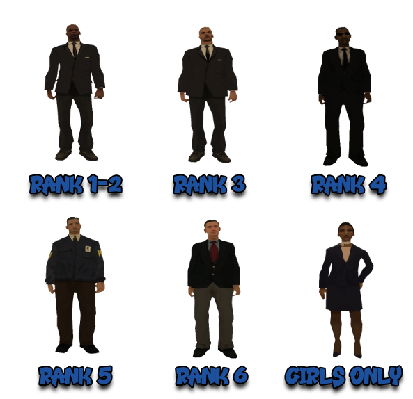
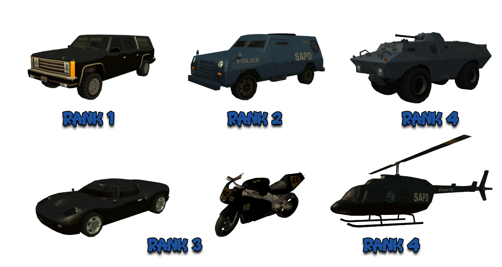

# Regulament Federal Bureau of Investigations

Pe langa acest regulament, toti membrii au obligatia de a respecta inclusiv [Regulamentul Serverului](../..) cat si [Regulamentul Departamentelor](../department-rules.md).

## 1. Comenzile Factiunii

- [/r] - vorbesti pe chatul factiunii.
- [/d] - vorbesti pe chatul comun intre departamente.
- [/duty] - te pui la datorie.
- [/mdc < id >] - verifici infractiunile unui jucator.
- [/tazer] - montezi electrosocul pe Deagle si imobilizezi jucatorul in care tragi timp de 8 secunde.
- [/su < id >] - acorzi wanted unui jucator dintr-o lista predefinita.
- [/nearwanted] - deschizi o lista a jucatorilor cu wanted din apropierea ta.
- [/wanted] - arata toti suspectii care au wanted.
- [/m < text >] - din interiorul unui vehicul de politie, folosesti megafonul pentru a transmite un mesaj pe o raza mai mare.
- [/ms] - trimiti un mesaj (somatie) automat jucatorului pe care ai find.
- [/cuff < id >] - incatusezi un jucator.
- [/clear < id >] - stergi wantedul unui jucator (in caz ca l-ai acordat gresit).
- [/punish < id >] - blochezi un jucator din Jail pentru cateva secunde.
- [/ram] - fortezi intrarea intr-o casa incuiata.
- [/arrest < id >] - arestezi un jucator care are wanted.
- [/frisk < id >] - perchezitionezi un jucator pentru a vedea daca are obiecte ilegale asupra lui.
- [/confiscate < obiect > < id >] - confisti obiectele (materiale / droguri) ale unui jucator.
- [/lawyer < id > < pret >] - vinzi mandate de eliberare (ai nevoie de 15 puncte pentru un mandat).
- [/acceptpoints] - afli cate puncte detii pentru a vinde mandate.
- [/gov < text >] - chatul global guvernamental folosit doar pentru anunturi importante.
- [/undercover < ON/OFF >] - iti schimba skinul si devii civil.
- [/namecover < ID > < NEW NAME >] - schimbi numele si skinul unui membru FBI, facandu-l totodata civil.

## 2. Skinurile Factiunii

<figure markdown="span">
    { width="800" }
</figure>

2.1 Aveti voie sa purtati skinurile de rank inferior rankului vostru (ex: aveti rank 5, puteti purta skinurile de la rank 1-4).

## 3. Vehiculele Factiunii

<figure markdown="span">
    { width=1000" }
</figure>

- 26 FBI Rancher - Rank 1.
- 5 FBI Truck - Rank 4.
- 3 NRG - Rank 3.
- 7 Bullet - Rank 3.
- 3 SWAT - Rank 4.
- 1 Police Maverick - Rank 4.

3.1 Nu aveti voie sa folositi vehiculele de tip "SWAT" pentru a stropi jucatorii, pentru a ii tine la pamant. Cine nu respecta regula este sanctionat cu Avertisment Verbal sau Faction Warn, in functie de caz. In cazul protestelor sau jucatori care incurca traficul, aveti voie sa folositi apa pentru a ii calma.

3.2 Sa va asigurati ca nu parcati masina peste locul unde se respawneaza un vehicul FBI sau unde sunt arestati suspectii (sanctiune: Avertisment Verbal la prima abatere, Faction Warn la urmatoarea).

3.3 Atunci cand gasiti o masina dintr-un departament: Infernus, Turismo, Bullet, NRG-500, Maverick sa anuntati ca o luati, exemplu: "[/d] Am gasit un Bullet in zona Fort Carson, il iau." (sanctiune: Faction Warn).

3.4 Bullet-urile si Nrg-urile pot fi folosite de catre membrii cu Rank 3+, acestia sunt obligati sa anunte pe /r.

3.5 Tancul cu apa poate fi folosit de membrii de Rank 4.

3.6 Elicopterul poate fi folosit doar de membrii de Rank 4+, NU pentru plimbari. Cei cu rank sub 4, trebuie sa ceara aprobare.

## 4. Suspectii

4.1 Membrii FBI au prioritate in capturarea si arestarea suspectilor cu wanted 3 si 4 si a celor fara drept de predare (exceptie de la aceasta regula au membrii rank 4+ care pot merge dupa orice wanted). In cazul in care in lista /wanted nu mai sunt jucatori cu wanted 3 si 4, membrii FBI se pot angaja sa captureze / aresteze jucatorii cu wanted 1 si 2, iar apoi 5 si 6. In cazul in care un suspect de wanted 1/2, respectiv 5/6, se preda ( se urca in masina fara sa fie somat ), ii dati [/cuff], il transportati pana la cel mai apropiat HQ de departament si intrebati un PD, respectiv NG, daca il aresteaza ei sau voi (sanctiune: Faction Warn).

!!! danger "Important"
    In cazul in care nu sunt suspecti prioritari departamentului din care faceti parte, faceti un ss la [/wanted] si porniti in capturarea unui jucator care nu va este prioritar la nivelul de wanted, aveti la dispozitie 5 minute sa capturati orice jucator respectand regula de baza. Daca cele 5 minute au trecut, dar totusi ati apucat sa ii acordati suspectului o somatie/doua va puteti continua urmarirea, daca nu, verificati din nou [/wanted] si in functie de ce suspecti sunt va continuati activitatea.

4.2 In cazul in care un membru de departament acorda wanted unui jucator, acesta are dreptul de a-l aresta, indiferent de wanted level. Daca, inainte de a-l aresta, membrul respectiv iese din joc, suspectul ii revine departamentului ce are prioritate pe wantedul sau.

4.3 Este interzisa favorizarea jucatorilor. Un Agent FBI trebuie sa dea dovada de CORECTITUDINE (sanctiune: Faction Warn).

4.4 Cand aveti un suspect la voi, sunteti obligat sa-i acordati [/cuff] pentru ca ceilalti membri din departamente sa vada ca este la voi. Nu aveti voie sa ii dati [/uncuff] pana cand suspectul nu ajunge in jail (exceptie: cand suspectul detine droguri si trebuie sa coboare din masina in garaj) (sanctiune: Avertisment Verbal).

4.5 Este strict interzisa folosirea avantajelor de politist (sub orice forma) cand situatia nu o cere (sanctiune: Faction Warn sau demitere).

4.6 Daca un gangster se afla in incinta HQ-ului (incinta include curtea HQ-ului cu parcarea acestuia) nu aveti voie sa ii confiscati armele. Regula nu se aplica daca gangsterul respectiv va ataca pe voi sau pe orice alt jucator care nu apartine gangului respectiv (sanctiune: Faction Warn).

4.7 In cazul in care suspectati un jucator cu wanted ca detine droguri sunteti obligati sa il somati pe NUME, sa specificati numele departamentului si sa ii explicati motivul in somatie, cu comanda [/m]. Ex: "Stop aici ! F.B.I. MaxyMusSs trage pe dreapta, control! risti wanted 2!"

4.8 Controalele de rutina efectuate in trafic (presupune sa opresti jucatori care circula cu vehicule) se fac doar cu vehiculele departamentelor. Daca agentul se afla pe jos la momentul efectuarii controlului, implicit in momentul acordarii somatiilor, e irelevant modul in care agentul a ajuns acolo (sanctiune: Faction Warn).

4.8.1 Inainte de a efectua un control de rutina pe jucatorii aflati intr-un vehicul si de a-i soma sa coboare, trebuie sa va asigurati ca acestia sunt prezenti la PC (sa se miste sau sa scrie in chat) si sa aveti dovezi in acest sens (sanctiune: Faction Warn).

4.9 Un agent FBI care este inconjurat/atacat de mai multi detinuti in jail si nu are alta cale de scapare poate folosi comanda [/punish] pentru a scapa.

4.10 Pentru orice actiune, trebuie sa aveti dovezi in cazul unei reclamatii.

4.11 Este permis sa le confiscati armele jucatorilor aflati intr-un Clan Zone, cu conditia ca unul dintre membrii clanului care este pe turf sa aiba wanted (sanctiune: Faction Warn).

4.12 Orice membru Rank 3 + are voie sa mearga cu masina personala dupa wanted cu drept de predare (arrest). Orice membru Rank 1+ are voie sa mearga cu masina personala dupa wanted fara drept de predare.

4.13 Toti membrii departamentelor de politie au obligatia de a avea comanda [/timestamp] activata (sanctiune: Avertisment Verbal la prima abatere, Faction Warn la urmatoarea).

4.14 Un politist are voie sa acorde wanted atunci cand un suspect ataca un alt membru al departamentelor in anumite situatii, exemplu: Atunci cand se trage de pe restaurant LS iar cei de jos nu pot vedea suspectul, atunci cand se trage asupra lui de la distante mari iar un coleg vede tot de aproape, alte cazuri (intrebati liderul).

4.15 Cand confiscati armele unui jucator, sunteti obligati sa-i spuneti si motivul. Un simplu text cu "armele la vedere" este suficient (sanctiune: Avertisment Verbal).

4.16 Nu aveti voie sa confiscati armele unui suspect, daca acesta nu are drept de predare (sanctiune: Faction Warn).

4.17 Este interzis sa acordati [/frisk], respectiv [/su] oricarui jucator atunci cand acesta este intr-un meci de poker (sanctiune: Faction Warn).

4.18 Pentru a confisca arme/droguri aveti nevoie de Rank 2+. Membrii FBI nu au dreptul sub nicio circumstanta de a confisca vreun tip de licenta (sanctiune: Faction Warn sau demitere in cazul unui abuz major).

4.19 Membrii de departament nu au voie sa conduca abuziv si sa deranjeze cu intentie ceilalti participanti al traficului (exemple: intratul intentionat de multiple ori in alti soferi, blocarea drumului, etc.) (sanctiune: Faction Warn).

4.20 In cazul in care suspectul fara drept de predare sare pe cladiri inalte folosind o bicicleta (folosindu-se de bugul high jump), fiind greu de prins si omorat, aveti dreptul de a deschide focul cu Hunter sau Hydra pentru a-i omori. Daca suspectul coboara de pe cladire, nu mai aveti voie sa deschideti focul, ci continuati urmarirea terestra. Asigurati-va ca aveti intotdeauna dovezi clare inainte de a deschide focul! Nerespectarea acestei reguli se va sanctiona cu Faction Warn la prima abatere, Rank Down la a doua abatere si Demitere daca va continua.

## 5. Factiune

5.1 Telefoanele vor fi inchise in timpul unei activitati FBI, fara sa fiti avertizati de un organizator (sanctiune: Avertisment Verbal la prima abatere, Faction Warn la urmatoarea).

5.2 Folosirea armei in Armory FBI in timpul sedintelor/antrenamentelor/intalnirilor de orice fel, este strict interzisa (sanctiune: Faction Warn).

5.3 Pentru a intra in FBI trebuie sa aveti skill 5 detective.

5.4 Atunci cand un politist incalca regulile de circulatie (merge pe contra-sens, foloseste nos etc), acesta sa fie sanctionat cu o amenda direct in joc de catre membrul PD sau daca e reclamat pe website, cu o amenda de catre Lider, iar in cazul in care n-o achita in 24 de ore primeste Faction Warn.

5.5 Orice membru FBI are obligatia de a avea pe Website scurtatura cate profilul sau de forum. Aveti la dispozitie 48h din momentul intrarii in factiune sa faceti asta. Cine nu are aceasta scurtatura catre profilul de forum dupa cele 48h o sa fie sanctionat cu Avertisment Verbal, iar dupa 24h daca situatia nu va fi remediata se va acorda Faction Warn.

5.6 Nu aveti voie sa practicati (sa folositi [/work] sau alte comenzi aferente pornirii job-ului, inclusiv farmer) alt job in afara de cel de Detectiv sau Mecanic (strict pentru intretinerea masinilor in urmarire) atunci cand sunteti on duty (sanctiune: Avertisment Verbal la prima abatere, Faction Warn la urmatoarea).

5.7 Candidatii care trec testele de intrare nu au voie sa fie [/duty] on sau sa foloseasca chat-ul [/d] (sanctiune: picarea testelor).

5.8 Cei care detin materiale sau droguri au la dispozitie 24 de ore de la intrarea in factiune sa scape de ele. Folositi comanda [/throw] pentru a scapa de ele (sanctiune: Faction Warn).

5.9 Orice jucator care a fost acceptat pentru a sustine testele trebuie sa se comporte decent. Daca acesta jigneste sau are un comportament neadecvat fata de un membrul al factiunii, acesta este automat respins fara a mai avea dreptul de a sustine testele de intrare in factiune.

## 6. Activitati

6.1 Activitatile obligatorii pot sa fie organizate de catre Lider cu un motiv bine intemeiat si cu aprobarea unui Admin Senior. Avand in vedere ca o sa fie destul de rare, toti membrii trebuie sa se prezinte si nu au dreptul la invoire, cu exceptia jucatorilor care au cerere de inactivitate pentru saptamana respectiva. O activitate obligatorie este valida cat timp este anuntata cu minim o saptamana inainte (sanctiune: Faction Warn).

- in cazul adminilor de nivel 1-3, daca activitatea obligatorie are loc pe parcursul desfasurarii warurilor, acestia vor fi automat invoiti, cu conditia ca ei sa-si indeplineasca atributiile de admin in ce priveste prinderea codatilor.
- in cazul subliderilor, liderul va decide daca doreste sa sanctioneze sau nu absenta acestora de la activitatile obligatorii cand acestia nu au cerere de inactivitate pentru saptamana respectiva.

6.2 Sedinta va avea loc cand considera liderul ca este nevoie. Sedinta va fi intotdeauna obligatorie.

6.3 O activitate optionala o sa dureze minim 20 de minute si maxim 50 de minute (activitatea nu se ia in calcul + Avertisment Verbal antrenorului)

## 7. Chatul Factiunii

7.1 In timpul activitatilor nu vorbeste nimeni decat daca aveti permisiunea liderului sau a antrenorului. Cine nu respecta regula va primi Avertisment Verbal la prima abatere, fiind sanctionat cu Faction Warn daca se continua la aceeasi activitate.

7.2 Este interzisa folosirea Caps Lock-ului, spam-ul, injuraturile ( atat cenzurate cat si necenzurate ) pe [/r]. Cine incalca regula primeste Avertisment Verbal, Faction Warn sau Demitere, in functie de caz. 

## 8. Namecover

8.1 Modelul pentru a cere namecover este: ID | Nume nou | Nu am arme, armura si spray | Motiv

!!! danger "Important"
    Namecover este o comanda speciala de care se pot folosi doar membrii departamentului FBI. Aceasta este folosita indeosebi pentru operatiuni extreme si pentru a depista diverse infractiuni fara a trezi suspiciuni. La aceasta comanda au acces doar agentii ce detin Rank 5+, acestia o pot aplica si celorlalti membri.

8.2 Este interzis ca un agent FBI sa-si dezvaluie identitatea de fata cu un civil. De aceea un agent cu undercover nu are voie sa detina arme. Vom pastra comanda, precum si operatiunile undercover, un secret (sanctiune: Faction Warn).

8.3 Este strict interzis ca agentul aflat sub acoperire sa faca abuz de identitatea sa. Prin abuz putem intelege: Death-Match aiurea, Limbaj etc. Pentru diverse abuzuri de acest gen, respectivul membru va fi sanctionat cu Faction Warn sau va fi demis in functie de caz.

8.4 Pentru ca dovezile sa fie valabile in raportul de activitate trebuie sa se vada ca aveti undercover. Se face o poza la [/frisk] si o poza la [/su]. Pozele cu page-up nu se iau in considerare.

!!! example "Exemplu"
    O actiune corecta: poza cand primesti namecover (cererea + mesajul cand ai primit namecover), poza la [/frisk], poza la [/su], poza cand scoti namecoverul intr-un loc ferit.

8.5 Este permis ca un agent aflat sub acoperire sa cumpere droguri si chiar sa le foloseasca. Acest lucru poate duce la capatarea increderii fata de traficant. De asemenea membrul cu namecover poate folosi NOS si Hidraulice, dar nu in mod abuziv.

8.6 Undercoverul mai poate fi folosit si pentru a acorda wanted unor civili ce incalca legea. Aceasta regula se adreseaza, in special, celor de Rank 1 si vizeaza urmatoarele infractiuni:

- atacarea unui civil (civilul in cauza poti fi chiar tu cu undercover).
- rapirea unui civil (civilul in cauza poti fi chiar tu cu undercover).
- drive-by (shot sau calcat).

8.7 Namecover poate fi utilizat si pentru depistarea celor ce vor sa jefuiasca.

8.8 Agentii FBI de Rank 5+ trebuie sa faca poze dupa fiecare [/namecover] acordat, si sa pastreze o evidenta a numelor acordate (pozele), in caz ca va fi nevoie (sanctiune: Faction Warn).

8.9 Membrii de Rank 5 sunt obligati sa anunte printr-un mesaj pe chat-ul departamentului [/r] atunci cand folosesc comanda [/namecover] pentru fiecare membru (sanctiune: Avertisment Verbal).

8.10 Ca membru FBI, aveti dreptul sa detineti in permanenta maxim 50 de grame de droguri. Atentie, drogurile sunt destinate folosirii doar in cazul in care sunteti intr-o misiune namecover, ca civil (exemplu: pentru castigarea increderii suspectului) (sanctiune: Faction Warn).

8.11 Intr-o misiune Namecover va este strict interzis sa folositi vreun mod pe skin (cskin etc.) (sanctiune: Faction Warn).

8.12 Postati raportul namecover pe saptamana curenta, abia dupa ce a aparut statistica pe saptamana precedenta (sanctiune: Avertisment Verbal la prima abatere, Faction Warn la urmatoarea).

8.13 Aveti voie sa folositi orice nume la namecover (Este interzisa folosirea unui nume la misto, indecent, foarte asemanator cu al altor jucatori/admini, cu tag de clan oficial).

8.14 Nu aveti voie sa dati [/accept] [/admins] [/helpers] sau alte comenzi de genul care sa va umple chatul cand sunteti namecover. In cazul in care in pozele voastre apar vreuna din comenzi sau altele raportul vostru namecover nu se va lua in considerare.

8.15 Namecover cereti doar intr-un interior (HQ sau CASA). [/undercover off] folositi doar intr-un interior (HQ sau CASA). Cine nu respecta regula i se anuleaza raportul namecover si primeste Faction Warn.

8.16 In cazul in care suspectul cu droguri iese din joc sau ia crash aveti nevoie de un video de cateva secunde in care sa se vada mesajul "jucatorul nu este conectat".

8.17 In cazul in care suspectul pe care tocmai l-ati sanctionat cu wanted pentru "posesie folosire droguri", nu mai are drogurile la el o sa faceti o poza la [/frisk].

8.18 Nu aveti voie sa efectuati raportul namecover pe colegii din clan. 

8.19 Daca ati fost promovat la Rank 2 Luni - Miercuri aveti de intocmit raportul namecover, iar daca ati promovat Joi - Duminica sunteti scutiti sa postati raportul namecover.

8.19.1 Daca ati fost promovat la Rank 4 Luni - Miercuri sunteti scutiti sa postati raportul namecover, iar daca ati promovat Joi - Duminica aveti de intocmit raportul namecover.

8.20 In momentul in care membrul isi seteaza / primeste raport optional, in saptamana respectiva membrul este scutit si de raportul namecover.

## 9. Activitate Forum

9.1 Activitatea pe forum este specifica pentru cei care ajung la Rank 5 si se vor ocupa de un topic anume impreuna cu alti colegi, acestia vor face cu schimbul.
 
9.2 Persoanele care sunt puse in saptamana respectiva se gasesc in topicul "[Activitate Forum](https://forum.b-zone.ro/topic/459201--)" si trebuie sa posteze statistica de la topicul respectiv pe saptamana trecuta.
 
9.3 Persoanele care sunt colorate cu verde au de postat in topicul respectiv fiecaruia. Sus este specificata saptamana in care ne aflam, iar statistica trebuie postata pentru saptamana trecuta. Cele care sunt colorate cu rosu au de asteptat pana o sa urmeze randul lor.
 
9.4 Logul de la raportul de activitate, cereri activitati si cel de la prezente activitati se posteaza mereu duminica la terminarea saptamanii sau cel mai tarziu miercuri. Misiunea saptamanii si raportul namecover se posteaza mereu luni la inceputul saptamanii.
 
9.5 Sanctiunea pentru nepostarea la timp este Faction Warn.

## 10. Testeri

10.1 Membrilor cu rank cuprins intre 4 si 6 (inclusiv) le este strict interzis sa modifice statutul candidatului in respins/acceptat fara acordul liderului. Modificarea statutului jucatorului fara acordul liderului se considera favorizare si se pedepseste cu Faction Warn prima data, Rank Down daca continua. 

10.2 Inainte de a incepe un test, asigurati-va ca aplicantul are caile de comunicatii inchise. Odata ce folositi [/ft] pe un jucator, in mod normal, acestea i se inchid automat. Comanda [/togcomms] inchide sau deschide caile de comunicare.

10.3 In cazul recrutarilor in care candidatul poate da test cu orice tester, un tester nu va avea voie sa sustina teste cu un jucator din acelasi clan/alianta cu el (sanctiune: RANK DOWN + Faction Warn). Exceptie fac liderul si subliderii, impreuna cu eventualele situatii speciale ce pot aparea, stabilite de conducere, in care se poate tolera acest lucru, aplicate pe loc in functie de caz.

10.4 In cazul recrutarilor in care fiecarui candidat ii este acordat un tester sau mai multi, testerii nu vor avea voie sa dea test cu altcineva decat cu candidatii la care au fost repartizati. Exceptie fac Rank 6, ei pot da test cu orice candidat oricand (sanctiune: RANK DOWN + indepartarea functiei de tester).
