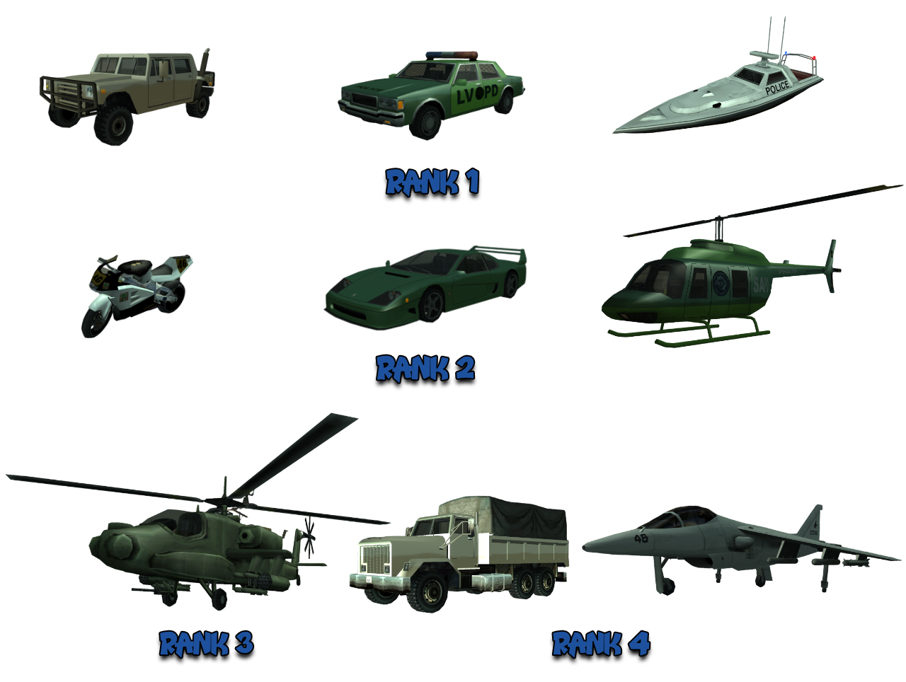
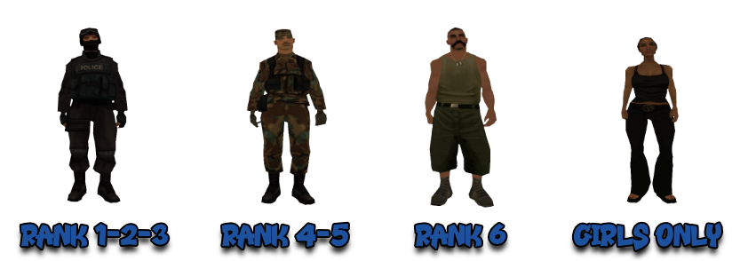

# Regulament National Guard

Pe langa acest regulament, toti membrii au obligatia de a respecta inclusiv [Regulamentul Serverului](../..) cat si [Regulamentul Departamentelor](../department-rules.md).

## 1. Comenzile Factiunii

- [/r] - vorbesti pe chatul factiunii.
- [/d] - vorbesti pe chatul comun intre departamente.
- [/mdc < id >] - verifici infractiunile unui jucator.
- [/tazer] - montezi electrosocul pe Deagle si imobilizezi jucatorul in care tragi timp de 8 secunde.
- [/su < id >] - acorzi wanted unui jucator dintr-o lista predefinita.
- [/nearwanted] - deschizi o lista a jucatorilor cu wanted din apropierea ta.
- [/m < text >] - din interiorul unui vehicul de politie, folosesti megafonul pentru a transmite un mesaj pe o raza mai mare.
- [/ms] - trimiti un mesaj (somatie) automat jucatorului pe care ai find.
- [/cuff < id >] - ca sofer, incatusezi un jucator.
- [/clear < id >] - stergi wantedul unui jucator (in caz ca l-ai acordat gresit).
- [/punish < id >] - blochezi un jucator din Jail pentru cateva secunde.
- [/ram] - fortezi intrarea intr-o casa incuiata.
- [/arrest < id >] - arestezi un jucator care are wanted.
- [/frisk < id >] - perchezitionezi un jucator pentru a vedea daca are obiecte ilegale asupra lui.
- [/confiscate < obiect > < id >] - confisti obiectele (materiale / droguri) ale unui jucator.
- [/lawyer < id > < pret >] - vinzi mandate de eliberare (ai nevoie de 15 puncte pentru un mandat).
- [/acceptpoints] - afli cate puncte pentru a vinde mandate detii.
- [/gov < text >] - chatul global guvernamental folosit doar pentru anunturi importante.

## 2. Jailul

### Reguli Generale Jail

2.1 Echipa de paznici este formata din membrii National Guard de Rank 1, cat si cei de rank 2, acestea 2 avand si acces pe teren (rank 1 acces limitat).

2.2 In zona cu celulele au voie numai membrii Departamentelor si prizonierii.

2.3 Nu se vor lasa civilii fara wanted sa mearga in zona celulelor.

2.4 Se considera Teren Guvernamental partea dintre Gate 1 si Gate 2, persoanele aflate in aceasta zona vor fi somate de 3 ori si se va astepta 1 minut de la ultima somatie. Persoanele ce trec de Gate 2 vor primi wanted 2 "Teren Guvernamental" fara somatie fiind considerate detinuti (sanctiune: Faction Warn).

2.5 Persoanele aflate in prima incapere fara motiv vor fi somate de 3 ori + se va astepta 1 minut de la ultima somatie, in caz contrar primesc wanted 2 "Neconformare ordin" (sanctiune: Faction Warn).

2.6 Aveti voie sa arestati suspectii care vin singuri si se predau indiferent de wantedul pe care il au, cu conditia sa ii verificati [/mdc]-ul (pe "i"-ul de unde se da clear) daca are drept de predare, iar apoi sa intrebati pe [/d] daca suspectul nu este la cineva.

2.7 Daca la Jail este un PD / FBI / National Guard si vine un suspect de orice wanted, membrul National Guard are prioritatea sa-l aresteze. Daca la Jail nu se afla nici un membru National Guard (la arrest, celule sau in Yard), atunci PD / FBI are dreptul de a aresta orice wanted se afla in interiorul Jailului.

2.8 Cand cineva gaseste un suspect la Jail, intreaba pe [/d]: [numele suspectului] este la cineva?. Daca cineva spune "Da", atunci trebuie sa-i predati suspectul persoanei care v-a raspuns.

2.9 PD, FBI si National Guard trebuie sa foloseasca [/duty] in Armoury sau in casa pentru a putea folosi orice comanda specifica politiei (incluzand mersul cu masinile politiei, armura la [/heal]).

2.10 Este interzis sa stati in jail On-Duty AFK mai mult de 5 minute indiferent de situatie. Daca doriti sa luati o pauza mai mare de 5 minute, puteti sta in Prima Camera, dupa gratii (exemplu: [AICI](https://imgur.com/bMeWogi)), ori puteti sta in Zona de siguranta dintre cele 2 porti (exemplu: [AICI](https://imgur.com/nz5SxiK)). In ambele cazuri trebuie sa fiti Off-Duty (sanctiune: Faction Warn sau Demitere in functie de caz).

2.11 Scoaterea unui prizonier din celula se face prin a-i cere acestuia sa foloseasca animatia [/handsup], urmand sa fie incatusat [/cuff], si doar apoi se va deschide celula acestuia. Sa va asigurati ca iese doar prizonierul dorit din celula si nu toti. Dupa scoaterea prizonierului din celula nu uitati sa inchideti celula.

2.12 In cazul in care sunt scosi mai multi prizonieri din celule si nu le mai puteti face fata aveti dreptul sa folositi armele asupra lor (mare atentie la aceasta regula, folositi armele numai in situatii grave).

2.13 Aveti voie sa folositi [/tazer] in limita bunului simt. In caz ca nu reusiti sa prindeti detinutul pentru a-i acorda punish, in situatii extreme cand sunteti atacat de unul sau mai multi prizioneri si in caz ca se foloseste de anumite buguri pentru a-si ascunde numele si ID-ul. Pentru a evita situatiile neplacute cand se creaza bug, se recomanda sa asteptati 8 secunde inainte de a folosii comanda [/punish] pe un detinut care a primit [/tazer].

2.14 Eliberarea unui prizonier din celula se va face numai cu motiv intemeiat. Nu eliberati detinutii fara motiv. Motive pentru eliberare detinutilor din celula:

- cand acesta doreste sa bea ceva de la bar;
- transfer in alta celula (doar daca membrul National Guard, considera ca este necesar).

2.15 Cei care au jobul de lawyer isi vor face reclama pe [/ad] sau [/news], nu au voie sa vina la Jail sa-si faca reclama.

2.16 Programul de deschidere a celulelor este cuprins in intervalul 8:00 - 2:00, la fiecare Payday (0:00) si la fiecare jumatate de ora (:30), deschizandu-se automat din script.

2.17 In curtea Jailului pot intra maxim 4 gardieni.

2.18 Pentru a prinde jucatorii evadand, membrul National Guard trebuie sa fie in apropierea persoanei sau persoanelor care vor sa scape. Daca e suficient de aproape de acesta sau acestia ei vor intra automat in Jail cu sentinta maxima, iar membrul National Guard va primi un mesaj pe ecran cu acest lucru.

2.19 Daca jucatorul sau jucatorii reusesc sa scape din Jail, acestia vor primi Wanted 6 temporar, timp in care membrii National Guard (Rank 2+) sau orice alt membru din Departamentele de politie se pot duce dupa ei si sa-i omoare.

2.20 Exista o limita de un minut pana cand Departamentele sunt alertate ca cineva a evadat, timp in care suspectii raman cu skinul de Jail si nu primesc wanted. Daca suspectii sunt omorati, acestia intra in Jail cu sentinta maxima. Nu aveti voie sa-i omorati inainte de a primi wantedul pentru evadare.

2.21 Nu este permisa acordarea [/punish]-ului aiurea. Orice [/punish] trebuie sa aiba un motiv bine intemeiat si sa fie dat numai dupa ce s-au facut poze / video ca a incalcat o regula (sanctiune: Faction Warn).

2.22 Daca cineva da [/punish] intentionat celor care incearca sa evadeze special pentru a-i opri din asta (sanctiune: Faction Warn).

2.23 Singurul mod in care poti opri jucatorii din a evada este sa te afli in apropierea acestora cand incearca sa evadeze.

2.24 Nu aveti voie sa omorati detinuti fara motiv (sanctiune: Faction Warn).

2.25 Pentru a acorda [/punish] unui detinut, acesta trebuie sa va atace cu pumnii de minim 2-3 ori.

2.26 Pentru a acorda [/punish], un detinut trebuie sa dea cu pumnii in gratii de minim 2-3 ori.

2.27 Se poate acorda [/punish] in cazul in care un detinut va jigneste (sanctiune: Faction Warn).

2.28 In Jail, membrii National Guard au dreptul sa foloseasca comanda [/frisk] pe orice civil care intra acolo, chiar daca are sau nu wanted, exceptie facand cei fara drept de predare. In cazul in care descoperiti arme sau droguri asupra civilului respectiv, aveti voie sa le confiscati, cu explicatia "Ai intrat cu arme pe Teren Guvernamental" sau "Ai avut droguri la tine".

2.29 In jail, membrii National Guard pot confisca drogurile tuturor persoanelor aflate in interiorul acestuia.

2.30 In acest mod puteti vedea numele detinutilor din JAIL [ [CLICK AICI](https://www.youtube.com/watch?v=CwPMliiHVIU) ].

### Regulament Civili

2.31 Nu aveti voie sa veniti la Jail sa faceti spam cu "ma predau". Rugati un paznic sa va aresteze si asteptati linistiti.

2.32 Civilii fara wanted nu au ce cauta in Jail, exceptie avocatii ce au un client.

2.33 Nu aveti voie sa treceti de poarta 2 (in camera cu celule), primiti wanted 2 pe loc (FARA AVERTIZARE) pe motiv "Teren Guvernamental".

2.34 In caz ca sunteti lawyer, puteti da [/free] de la "i".

2.35 Trebuie sa respectati ordinele gardienilor, in caz contrar veti fi sanctionati cu wanted 2, pentru "Neconformare Ordin".

### Regulament Detinuti

2.36 Trebuie sa ascultati de gardieni.

2.37 Nu aveti voie sa faceti spam, rugand un gardian sa va scoata din celula indiferent de motiv, in felul acesta pierdeti sansa de a va scoate.

2.8 Nu aveti voie sa dati cu pumnii in gratii (inclusiv in pauza), sa va bateti colegul de celula sau gardienii, primiti [/punish].

2.9 Nu aveti voie sa treceti de poarta 1 sau poarta 2 (gate 1 sau gate 2) in timpul pauzei de 10 minute fara permisiunea gardianului, primiti [/punish].

2.10 Nu aveti voie sa va folositi de orice fel de buguri care va avantajeaza din interiorul sau curtea jailului, primiti [/punish].

2.11 Nu aveti voie sa coborati prin tunel jos in baza, cine este prins risca [/punish] [Exemplu](https://imgur.com/a/tB5FJGs).

2.12 Pentru orice anim obscen [/wank, /pee] se va acorda [/punish] fara avertisment.

2.13 Orice puscarias aflat in afara celulelor dupa terminarea pauzei o sa primeasca [/punish].

2.14 Nu aveti voie sa va bateti cu alti detinuti in pauza de 10 minute, riscati [/punish].

### Camerele Jailului

- prima camera: [click](https://imgur.com/3wfA1yZ)
- zona dintre Gate 1 & 2 / AFK ROOM: [click](https://imgur.com/kXOXWPZ)
- zona celulelor: [click](https://imgur.com/FDQlH07)
- yard: [click](https://imgur.com/Pskdjtd)

## 3. Reguli Generale

3.1 Membri National Guard sunt obligati sa aibe setat un cont de forum valid pe profilul de pe website. Membrii noi intrati au 48h la dispozitie de la invite sa-si seteze un profil valid de forum ([exemplu](https://imgur.com/JUBFwW4)) (sanctiune: Avertisment Verbal).

3.2 Cei care detin materiale sau droguri au la dispozitie 24 de ore de la intrarea in factiune sa scape de ele. Daca veti fi prinsi cu ele dupa cele 24 de ore, le veti avea confiscate. Ca sa scapati de ele rugati pe cineva din afara Departamentelor sa vi le tina, sau contactati un Rank 5+ sa vi le confiste (sanctiune: Faction Warn).

3.3 Membrii National Guard NU au dreptul sub nicio circumstanta de a confisca vreun tip de licenta.

## 4. Wanted si Arrest

4.1 In cazul in care un membru de Departament acorda wanted unui civil, acesta are dreptul de a-l aresta, indiferent de wanted level.

4.2 Prioritatea de urmarire si arestare a suspectilor de catre National Guard va fi doar Wanted 5-6 si cei fara drept de predare, iar daca in Wanted List nu exista decat Wanted 1-4 se va face poza prin care sa se demonstreze acest lucru, iar dupa accea se poate pleca in urmarirea suspectilor cu Wanted level mai mic de 5. Rank 4+ poate merge dupa orice suspect, cu orice Wanted (sanctiune: Faction Warn).

4.3 Membrii National Guard cu rank mai mic decat 4 au obligatia ca atunci cand un suspect cu wanted 1-4 vine si i se preda, sa-l incatuseze [/cuff], dupa care sa anunte pe [/d] ID-ul suspectului, wanted-ul si locatia aproximativa unde se afla. Suspectul va fi predat celui care va solicita asta pe [/d]. Puteti aresta suspectul doar cu acordul celor responsabili de el. In cazul in care nimeni nu raspunde pe chatul departamentelor dupa ce ati intrebat de 3 ori, aveti dreptul de a aresta suspectul (sanctiune: Faction Warn).

4.4 Membrii National Guard de RANK 1 au voie pe teren sa aresteze wanted 5-6 in afara jailului, acestia NU au voie> sa aresteze wanted 1-4 / suspecti fara drept de predare. 

!!! example "Nota informativa"
    Ei pot aresta suspecti de wanted mai mic, daca wantedul este acordat de acestia sau se pot apara daca sunt atacati.

4.5 Nu aveti permisiunea de a intra in business-uri in care au loc un eveniment, doar daca in acel interior se afla un suspect fara drept de predare (sanctiune: Faction Warn).

4.6 Daca un jucator se afla pe G la un suspect fara drept de predare, iar acesta NU face nimic, nu aveti nici un drept de a sanctionat jucatorul (sanctiune: Faction Warn).

## 5. Cop Attack/Kill

5.1 Pentru a-i acorda Wanted 3 cu motivul "Cop Attack" unui jucator, trebuie sa aveti dovezi foto sau video (de preferat dovezile sa fie video sau multiple poze evidente) ca jucatorul a avut intentia sa va atace, sa fie clar ca n-a fost din greseala. Mesajul informativ care arata cat damage ati primit nu este suficient pentru a acorda Wanted 3 pentru Cop Attack (sanctiune: Faction Warn).

5.2 Pentru a pierde dreptul de predare un jucator trebuie sa va atace cu pumnii de minim 4 ori sau sa traga cu arma in voi (valabil si in jail) (sanctiune: Faction Warn).

5.3 Nu aveti voie sa acordati wanted pentru "Cop Attack" sau "Cop Kill" jucatorilor care va ataca in cadrul unui event, atunci cand sunteti prezenti in acea locatie pentru a omori un suspect ce nu are drept de predare. Indicat este sa anuntati organizatorul acelui event scopul prezentei voastre in acel loc (sanctiune: Faction Warn).

5.4 In cazul membrilor de rank 1 acestia nu au voie sa plece in urmarirea suspectilor, ci doar sa-i omoare in legitima aparare, atunci cand sunt atacati.

5.5 Daca un membru National Guard este atacat de catre un player fara wanted, se aplica regula auto-apararii putand sa-l omoare pe jucator, membrul nefiind sanctionat.

## 6. Confiscate si Frisk

6.1 Cand confiscati armele unui jucator, sunteti obligati sa-i spuneti si motivul. Un simplu text cu "arme la vedere" este suficient (sanctiune: Avertisment Verbal).

6.2 Membrii National Guard pot da [/frisk] si confiscate weapons / drugs in jail si pe teren. Acestia nu au voie sa execute controale de rutina (sa traga pe dreapta jucatori) (sanctiune: Faction Warn).

6.3 Membrii National Guard nu au voie sa ceara licentele unui jucator [/reuestlicenses] deoarece nu au voie sa faca controale de rutina (sanctiune: Faction Warn).

6.4 In cazul in care suspectati un jucator ca ar avea droguri, aveti obligatia de a folosi inainte de toate [/frisk] pe aceasta, ulterior putand folosi [/confiscate]. In cazul unei reclamatii este necesar sa prezentati dovada ce contine [/frisk] (sanctiune: Avertisment Verbal la prima abatere, Faction Warn daca se mai repeta).

## 7. Vehiculele Factiunii

<figure markdown="span">
    { width=1000" }
</figure>

- 20 Patriot - Rank 1.
- 17 Police Car - Rank 1.
- 2 Predator - Rank 1.
- 3 NRG - Rank 2.
- 7 Turismo - Rank 2.
- 1 Maverick - Rank 2.
- 2 Rustler - Rank 2.
- 3 Hunter - Rank 3.
- 3 Barracks - Rank 4.
- 4 Hydra - Rank 4.

7.1 Aveti voie sa deschideti focul cu Hydra, Hunter si Rustler, doar in cazul in care suspectul fuge cu Avion / Elicopter (Air vs Air) (sanctiune: Rank Down).

7.2 In cazul in care suspectul fara drept de predare sare pe cladiri inalte folosind o bicicleta (folosindu-se de bugul high jump), fiind greu de prins si omorat, aveti dreptul de a deschide focul cu Hunter sau Hydra pentru a-i omori. Daca suspectul coboara de pe cladire, nu mai aveti voie sa deschideti focul, ci continuati urmarirea terestra. Asigurati-va ca aveti intotdeauna dovezi clare inainte de a deschide focul! Nerespectarea acestei reguli se va sanctiona cu Faction Warn la prima abatere, Rank Down la a doua abatere si Demitere daca va continua.

7.3 Doar membrii de Rank 3+ pot urmari / aresta suspecti cu drept de predare si cu masinile personale ca sofer, exceptie in cazul suspectilor cu nodrept, in cazul lor orice rank 2+ pot folosi masini personale (sanctiune: Faction Warn).

7.4 Sunteti obligati sa porniti girofarul atunci cand plecati intr-o misiune de urmarire (sanctiune: Avertisment Verbal la prima abatere, Faction Warn la urmatoarea).

7.5 Aveti voie sa incalcati regulile de circulatie cand conduceti o masina de politie cu girofarul pornit (sanctiune: Faction Warn).

7.6 Membrii FBI / National Guard vor putea urmarii suspecti si in masini de civil. In cazul in care merg dupa suspecti ce au drept de predare trebuie sa respecte regulile de circulatie, iar in cazul in care suspecti urmariti nu au drept de predare pot incalca acele reguli (sanctiune: Faction Warn).

7.7 Atunci cand un politist incalca regulile de circulatie (merge pe contra-sens, foloseste nos etc), acesta sa fie sanctionat cu o amenda indiferent de fapta comisa, iar in cazul in care n-o achita in 24 de ore primeste Faction Warn.

7.8 Daca doriti sa folositi un vehicul de la un departament trebuie sa anuntati pe [/d] (cum procedeaza rank 5+ in momentul de fata). In cadrul unei activitati, membrii factiunilor pot sa refuze ca vehiculele sa fie luate (sanctiune: Avertisment Verbal la prima abatere, Faction Warn la urmatoarea).

## 8. Skinurile Factiunii

<figure markdown="span">
    { width="800" }
</figure>

8.1 Aveti voie sa purtati skinurile de rank inferior rankului vostru (ex: aveti rank 5, puteti purta skinurile de la rank 1-4).

8.2 Nu este permisa purtarea unui skin de rank superior (sanctiune: Faction Warn).

!!! example "Nota informativa"
    Cu permisiunea Liderului se pot purta alte skinuri fata de regulile de mai sus.

## 9. Reguli Testeri

9.1 Membrilor cu rank cuprins intre 4 si 6 (inclusiv) le este strict interzis sa modifice statutul candidatului in respins / acceptat fara acordul liderului. Modificarea statutului jucatorului fara acordul liderului se considera favorizare si se pedepseste cu Faction Warn prima data, Rank Down daca continua.

9.2 Inainte de a incepe un test, asigurati-va ca aplicantul are caile de comunicatii inchise. Odata ce folositi [/ft] pe un jucator, in mod normal, acestea i se inchid automat. Comanda [/togcomms] inchide sau deschide caile de comunicare.

9.3 In cazul recrutarilor in care candidatul poate da test cu orice tester, un tester nu va avea voie sa sustina teste cu un jucator din acelasi clan / alianta cu el (sanctiune: Rank Down + Faction Warn). 

!!! danger "Important"
    Exceptie fac liderii si subliderii, impreuna cu eventualele situatii speciale ce pot aparea, stabilite de conducere, in care se poate tolera acest lucru, aplicate pe loc in functie de caz.

9.4 In cazul recrutarilor in care fiecarui candidat ii este acordat un tester sau mai multi, testerii nu vor avea voie sa dea test cu altcineva decat cu candidatii la care au fost repartizati. Exceptie fac  rank 6, ei pot da test cu orice candidat oricand (sanctiune: Rank Down + indepartarea functiei de tester).

## 10. Altele

10.1 In cazul in care un coleg de factiune face PM doar pentru a incurca un coleg, membrul va fi avertizat in prealabil de catre lider sa inceteze cu PM-urile si ii vor fi ignorate, urmatoarele abateri urmand sa fie sanctionate cu Faction Warn si chiar Demitere (daca este cazul).

10.2 Pentru a face parte din National Guard, aveti nevoie de Skill 5 Detectiv.

10.3 Este interzis sa faceti generalizari negative la adresa altor departamente sau colegilor, indiferent de problemele existente. Abaterea se va sanctiona cu Faction Warn sau Demitere, in functie de caz si numarul de abateri anterioare.

10.4 Orice jucator care a fost acceptat pentru a sustine testele trebuie sa se comporte decent. Daca acesta jigneste sau are un comportament neadecvat fata de un membrul al factiunii acesta este automat respins fara a mai avea dreptul de a sustine testele de intrare in factiune.

