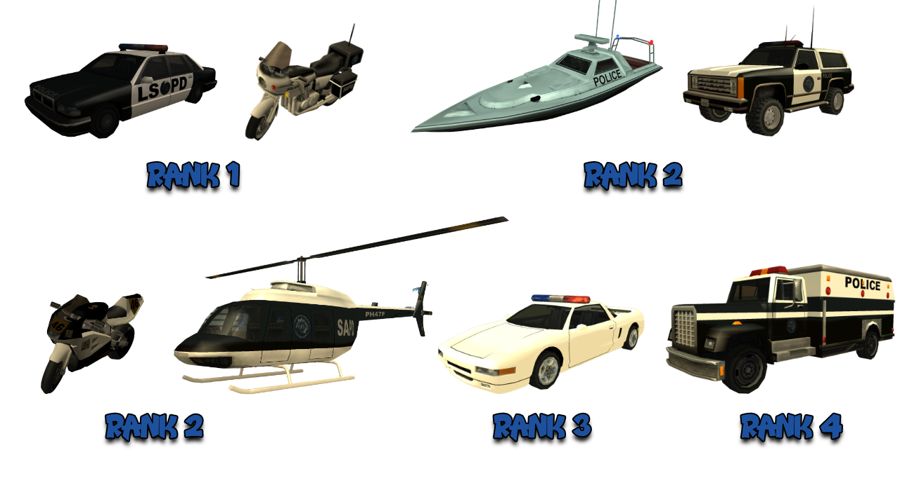
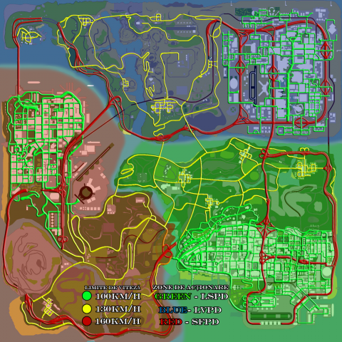

# Police Department Rules

Besides these rules, all members are obligated to respect both the [Server Rules](../..) as well as [Department Rules](../department-rules.md).

## 1. Faction Commands

- [/r] - you speak in the faction chat.
- [/d] - you speak in the common chat between departments.
- [/duty] - you put yourself on duty.
- [/mdc < id >] - you check a player's crimes.
- [/tazer] - you mount the stun gun on the Deagle and immobilize the player you shoot for 8 seconds.
- [/su < id >] - you grant wanted status to a player from a predefined list.
- [/nearwanted] - you open a list of nearby players with wanted status.
- [/wanted] - shows all the suspects that have wanted.
- [/m < text >] - from inside a police vehicle, you use the megaphone to broadcast a message over a larger area.
- [/ms] - you send an automatic message (warning) to the player you are aiming at.
- [/cuff < id >] - you handcuff a player.
- [/clear < id >] - you clear the wanted status of a player (in case you mistakenly granted it).
- [/punish < id >] - you lock a player from Jail for a few seconds.
- [/ram] - you force entry into a locked house.
- [/arrest < id >] - you arrest a player who has a wanted status.
- [/frisk < id >] - you frisk a player to see if they have illegal items on them.
- [/confiscate < object > < id >] - you confiscate a player's items (materials/drugs).
- [/lawyer < id > < price >] - you sell release warrants (you need 15 points for a warrant).
- [/acceptpoints] - you find out how many points you have for selling warrants.
- [/gov < text >] - governmental global chat used only for important announcements.
- [/backup] - marks the position on the map and sends a help message to all departments.
- [/cbackup] - cancels the above message.
- [/ticket < id >] - issue a fine to a player.
- [/startradar < limit >] - deploy a radar with a specific speed limit.
- [/stopradar] - stop the radar.

## 2. Faction Skins

<figure markdown="span">
    { width="800" }
</figure>

2.1 You are only allowed to wear the skin of your rank or lower ranks (e.g., a rank 4 roads member is allowed to wear rank 1, 2, or 3 skins from the roads category), and those of rank 5 can wear any lower rank skin, regardless of the corresponding team (sanction: Verbal Warning for the first offense, Faction Warn for the next).

## 3. Department Vehicles

<figure markdown="span">
    { width=1000" }
</figure>

- 23 Police Car - Rank 1.
- 8 HPV - Rank 1.
- 5 Police Ranger - Rank 2.
- 3 NRG-500 - Rank2.
- 1 Police Maverick - Rank 2.
- 2 Predator - Rank 2.
- 7 Police Infernus - Rank 3
- 3 Enforcer - Rank 4.

3.1 Do not use police vehicles for personal purposes (sanction: Faction Warn).

3.2 When you find a department vehicle, you are obligated to announce that you are taking it, for example: [/d] I found a bullet in the Bank SF area, I'm taking it.

3.3 Respawn department vehicles after you have finished using them.

## 4. General Overview

4.1 Faction Warn Clear manual is a privilege granted by the leadership of LSPD, not a right. Do not ask for FW clear from the leader or subleader (sanction: Faction Warn).

## 5. Meetings and Trainings

5.1 Anyone who is late for a meeting / training will come to the Armoury / Meeting Room without making noise in the chat or on [/r].

5.2 During meetings or training sessions, you will silence your phones and listen to the leader, subleader, or trainer until they allow you to speak. Until then, you are required not to use the chat without a valid reason (sanction: Verbal Warning or Faction Warn, as appropriate).

5.2.1 During activities, only faction leadership is allowed to approve the use of vehicles from the garage (sanction: Verbal Warning or Faction Warn, as appropriate).

5.3 Members present at activities are required to follow the organizer's instructions and demonstrate discipline and respect towards them. Jokes at their expense are not allowed (sanction: Verbal Warning or Faction Warn, as appropriate).

## 6. Roads and SWAT

6.1 You are required to respect the team you have been assigned to. The sanctions specified in this chapter will accumulate, potentially resulting in your Dismissal with FP if you do not respect this affiliation.

### Roads

6.2.1 The road team is primarily responsible for issuing fines and suspending players' driving licenses for violating traffic rules outlined in the Wanted & Ticket List topic.

6.2.2 Members of the road team are prohibited from using the [/confiscate] command (drugs, weapons, materials, etc.) while using the [/frisk] command to check for alcohol levels; the sanction is a Faction Warn! If a player caught by radar possesses illegal items, this can be reported on [/d], and a SWAT colleague will handle it.

6.2.3 A member of the road team is only allowed to arrest suspects whose wanted status has been granted by them or suspects who surrender to them voluntarily. In the latter case, it is necessary to ask on [/d] if you can take them. Additionally, they may respond by killing suspects who attack them (sanction: Faction Warn).

6.2.4 A member of the road team is not allowed to pursue suspects without the right to surrender (even if they have given them a wanted status), regardless of rank. They may only respond by killing suspects who attack them, whether or not they have the right to surrender (sanction: Faction Warn).

6.2.5 Members of the road team are prohibited from using their personal vehicle (for surveillance, issuing fines, etc.). They must use department vehicles for traffic-related actions (sanction: Faction Warn).

6.2.6 They may use their personal vehicle only if they are rank 3+ and want to arrest a player to whom they have given a wanted status.

6.2.7 Patroling in other cities must be approved by a rank 3+ member from the respective city's department.

6.2.8 If after 3 permission requests on [/d], with a minimum of 10 seconds between them, no response is received, the member may patrol.

6.2.9 The member is required to provide evidence of the permission received or of the three requests (sanction: Faction Warn).

6.2.10 The sanction for those who patrol in another city despite being refused by the department of that city, thus not having permission, is a Faction Warn.

6.2.11 The only situation in which you can confiscate licenses in other cities without patrol approval is when you are passing through and can prove it. If your evidence does not prove that you were passing through, you receive a Faction Warn.

6.2.12 You are not allowed to set up surveillance to confiscate licenses in other cities, under any circumstances (sanction: Faction Warn).

6.2.13 Members of the road team can use evidence from other police officers (regardless of team) to sanction a player.

6.2.14 You are not allowed to use evidence received from civilians; these will be considered invalid, and the officer will be sanctioned accordingly, that evidence being considered invalid.

6.2.15 Sanctioning suspects without the right to surrender when they violate traffic rules is prohibited.

### SWAT

6.3.1 The SWAT team is responsible for tracking and arresting suspects with wanted levels 1-2, killing suspects without the right to surrender (only rank 4+), searching players, and confiscating prohibited items (materials, drugs, and weapons) based on regulations.

6.3.2 SWAT members are prohibited from setting up radar (sanction: Faction Warn).

6.3.3 SWAT members are prohibited from carrying out road-related activities (confiscation, ticketing, etc.). If a SWAT member catches a player driving improperly, they can pass the evidence to a road team member! (sanction: Faction Warn).

6.3.4 SWAT members ranked 3+ can pursue/arrest with almost any vehicle.

6.3.5 Those ranked below 3 are prohibited from using anything other than department vehicles to pursue suspects with wanted levels. This rule applies only if the member is the DRIVER (sanction: Faction Warn).

6.3.6 SWAT members ranked 4+ are allowed to pursue any suspect with a wanted level (regardless of the current level of wanted, right to surrender).

6.3.7 Those ranked below 4 are prohibited from pursuing and arresting suspects with a wanted level higher than 2. They are required to focus on suspects with wanted levels 1-2, and if there are no wanted levels 1 and 2 in the Wanted List, a screenshot must be taken to prove this, and only then can pursuit of suspects with wanted levels 3 and 4, and then 5 and 6, be pursued (sanction: Faction Warn).

6.3.8 Any evidence from a department member will be considered valid; evidence from civilians is invalid.

6.3.9 Faction members ranked 5+ operate in both teams.

6.3.10 SWAT members ranked 2-3 can pursue players with wanted levels granted by them, regardless of the wanted level, as long as they have the right to surrender.

## 7. Tickets

7.1 If the fined player does not pay the fine on the spot (refuses or flees), the officer has the right to grant them the wanted level "Not Paying Ticket".

7.2 If the player does not have enough money on hand to pay the fine, the officer is obliged to take them to an ATM or the bank to withdraw the necessary amount to pay the fine. If the player refuses, the officer has the right to grant them the wanted level "Not Paying Ticket". If the player does not have enough money in the bank, they will receive the wanted level for "Not Paying Ticket".

7.3 You are not allowed to fine a player to whom you have given a wanted level 2 "Disobeying Orders". This rule also applies to players who leave the server and automatically receive wanted level 2 "Disconnected While Wanted" (sanction: Faction Warn).

7.4 You are not allowed to fine players in Jail (sanction: Faction Warn).

7.5 You are not allowed to give money to a player who does not have money to pay the fine (sanction: Faction Warn).

7.5.1 If a player is level 7 but their actual level is higher than 7 (they have RP for level 8+), they will not be allowed to choose between the fine and license confiscation but will be sanctioned by a fine and license confiscation.

7.6 Any officer caught violating traffic rules will pay the corresponding fine.

7.6.1 Any officer reported for violating traffic rules will pay a fine specified on the forum, in the Fines topic, where you can find this issue detailed. If they do not pay it within 48 hours, they receive a Faction Warn.

7.6.2 Department members are not allowed to drive recklessly and intentionally disturb other traffic participants (examples: intentionally hitting other drivers multiple times, blocking the road, etc.) (sanction: Faction Warn).

## 8. Driving

8.1 Driving is considered improper when the player drives on the opposite lane for at least 3 seconds. If the player does not return to the correct lane during these seconds, the officer has the right to pull them over and sanction them. This rule also applies if the player uses the sand, grass, or other textures alongside the road. They cannot be used to avoid the correct lane.

8.2 Driving is considered proper when it stays entirely within their lane or even when it slightly crosses onto the opposite lane.

8.2.1 Driving is still considered proper when it cuts across lanes at a 90-degree angle.

8.2.2 It is also considered proper driving when using grass, sand, etc., from the correct lane.

8.3 Intentionally hitting other players repeatedly with their vehicle is considered obstructing other traffic participants or disturbing traffic.

8.4 If you catch a department member driving on the wrong side (with a civilian car), you cannot confiscate their driver's license. Pull them over and take a screenshot with [/wanted], and if they claim to be chasing a non-surrender suspect, you are obligated to verify. If they are not chasing a non-surrender suspect, you give them a specific fine, which they must accept. Otherwise, you can report them via PM to their leader, and they will be sanctioned with a Faction Warn.

8.5 If you catch a department member violating traffic rules while off-duty, you are obligated to pull them over and issue them a specific fine. If they do not stop after three warnings or refuse to pay the fine, you can file a complaint via PM to their leader, and they will be sanctioned with a Faction Warn.

8.6 You are not allowed to suspend a driver's license for reasons other than those provided in the general department regulations and Wanted & Ticket List.

8.7 You can confiscate the license of an AFK player in jail only if you have explained the reasons beforehand.

8.8 You can confiscate the license of a player in jail as long as they are not AFK and you explain the reason for the suspension on the spot. In this case, you are obliged to specify the date, time, and location where the offense was committed.

8.9 An officer sanctioning a player administratively is obliged to communicate the committed offense, the approximate area where it occurred, and the sanction to be applied. If the offense was committed at a different time or even on a different day, the officer is obliged to communicate, in addition to all the details mentioned earlier, the day and time when the player was caught breaking the law (sanction: Verbal Warning).

8.9.1 If the suspect is administratively sanctioned within 10 minutes of committing the offense, the officer is no longer obliged to communicate any details, as the offense is recent enough for the player to know what they did. An exception to this rule is for players in jail (following the provisions mentioned in points 6.7 and 6.8).

8.10 A member is not allowed to sanction a Tow Truck Company member who is in the process of towing a vehicle and has their beacon on (sanction: Faction Warn).

8.11 A member is not allowed to sanction a Paramedics member who is on a mission with their beacon on. If you believe they are not truly on a mission, you can pull them over, and in case of potential abuse, they will be reported to their leader (sanction: Faction Warn).

8.12 If a paramedic is caught violating traffic rules while transporting a corpse with a Paramedic Romero and the beacon is not visibly on, the officer is obliged to verify if the paramedic is indeed dealing with the corpse. The verification process involves following the paramedic to their current destination (pickup or delivery point of the corpse). If it is proven that the paramedic abused the beacon to drive improperly, the officer is permitted to report them on the website.

## 9. Parking

9.1 Improper parking is considered when a player leaves their vehicle in the middle of the road for more than 5 seconds. If a player is instructed to pull over, the officer is obliged to guide them to park properly on the right side, where there is space and does not obstruct other traffic participants (e.g., on the sidewalk, on the right side of the highway, on the right side of the tunnel, etc.).

9.2 If the player refuses to park properly, then the officer has the right to sanction them. Also considered improper parking is when a player parks in the middle of the road while at the wheel for more than 60 seconds.

## 10. The Radar

10.1 Players who exceed the minimum speed limit (100, 130, or 160 km/h) by 1 - 2 km/h will not be penalized.

10.2 When setting up/resuming a radar, regardless of the city you are in, you are obligated to announce it on the department chat, [/d].

10.3 Before setting up a radar in a certain area, you must ask three times on [/d] if the area is clear, and if the area is not in your city, you must request permission from a rank 4+ on [/d]. If you do not receive a response or are refused, you must wait 5 minutes before making another request.

10.3.1 You are obligated to have evidence of the permission received. If you do not have it, it will be considered that you set up the radar without permission and you will receive a Faction Warn.

10.3.2 If a rank lower than 4 grants you the right to set up radar in another city, you will do so at your own risk, and you may be penalized as if you did not have evidence for the radar.

10.4 Vehicles equipped with radar systems are: PD Car, Police Infernus, HPV-1000, and PD NRG-500.

## 11. Summons

11.1 Any summoning must be issued in the name of the players.

11.2 If you need to pull over a player who has a wanted level, you are obligated to use [/m], following the rules above (sanction: Faction Warn).

11.3 If a player WITHOUT a wanted level is a passenger in a vehicle and needs to be sanctioned for a misdemeanor, first pull over the driver, then, after they have stopped, instruct the passenger to exit. If they refuse to exit, grant them a wanted level for disobeying orders.

11.4 If a player is instructed to exit a vehicle and fails to comply, grant them Wanted 2 "Disobeying orders".

11.5 A person instructed to pull over by a police officer is required to park properly on the right side, otherwise, their license may be confiscated for improper parking.

## 12. Treating Civilians

12.1 Any player who is not part of a department is considered a civilian.

12.2 You are not allowed to kill a civilian if they request it or for you to ask to be killed by a civilian. You can only request this from a colleague in departments or commit suicide (sanction: Faction Warn).

12.3 If a player remains motionless and unresponsive (AFK without an hourglass) when prompted to exit the vehicle, accept the license presentation request [/requestlicenses], pay a fine, or surrender, you must wait 30 seconds from the last prompt before proceeding with the appropriate sanction (sanction: Faction Warn).

!!! example "Exceptions"
    If a player is in a vehicle parked correctly, not violating any rules, and is not moving (AFK without an hourglass), the officer does NOT have the right to prompt them to exit until the player moves again. 
    If a player who is not violating any rules remains motionless on the ground (e.g., is AFK without an hourglass at CNN), the officer is NOT allowed to request their licenses until the player moves again.

    For both exceptions, if the officer has evidence that the player has recently moved or written in the chat and intentionally went AFK to avoid sanctioning, they can proceed normally while adhering to the main rule above.

12.4 Routine traffic checks (involving stopping players driving vehicles) are only conducted using department vehicles. If the officer is on foot at the time of conducting the check, implicitly at the time of issuing warnings, how the officer arrived there is irrelevant (sanction: Faction Warn).

12.5 If a player refuses to exit the vehicle for a routine check after being prompted at least 3 times, they will receive Wanted 2 for "Disobeying Orders". Furthermore, if the suspect exits when prompted to surrender, and after using [/frisk] you notice they are in possession of drugs, you have the right to give them Wanted 3 for drug possession (totaling Wanted 5). If they are handcuffed and you need to confiscate the drugs, you can use [/eject] and then [/confiscate] at the department garage.

## 13. Wanted Suspects

13.1 The PDs deal with suspects with wanted levels 1 and 2 with the right to surrender.

13.2 A police officer can arrest a suspect to whom they have given a wanted level, regardless of the level of wanted, provided they have the right to surrender.

13.3 You are not allowed to pursue suspects with wanted levels 3+ who have the right to surrender if you did not give them the wanted level (sanction: Faction Warn).

13.4 A police officer with a rank lower than 4 has the obligation that when a suspect with a wanted level of 3+ comes and surrenders to them, to handcuff them [/cuff], then announce on [/d] the suspect's ID, wanted level, and approximate location. The suspect will be handed over to whoever requests it on [/d]. You can only arrest the suspect with the consent of those responsible for them. If nobody responds on the department chat after asking three times, you have the right to arrest the suspect.

13.5 The police officer has the obligation to hand over a suspect to another police officer if the latter has prompted them beforehand.

13.6 Police officers are obligated to patrol only with department vehicles.

13.7 Police officers of rank 1-2 are obligated to make arrests only with department vehicles.

13.8 When taking a suspect into custody, you are obligated to use [/cuff].

13.9 Suspects with the right to surrender lose their rights when they attack you at least 4 times with fists or shoot at you with at least 1 bullet.

13.10 If you are attacked or killed by a suspect, regardless of your location (Jail/HQ/Garage/Other area), the suspect will receive wanted level 3 - "Cop Attack", respectively wanted level 5 - "Cop Kill".

13.11 If a suspect (with the right to surrender) is AFK with a wanted level (on ESC), you warn them, announce on [/d] that they are AFK specifying the exact time, including seconds, and after 3 minutes (180 seconds), you can kill them.

13.12 If the suspect remains motionless when asked to surrender (provided that they are found standing still and remain still after being warned), the officer must wait for 30 seconds before having the right to kill them.

13.13 When arresting a suspect, you are obligated to take them to the nearest prison. For example, if you apprehend a suspect in the city of Los Santos, you must take them to the prison at LSPD. You are not allowed to transport them to prisons in other cities.

13.14 When a player has been caught by radar or any other offense that leads to the confiscation of their driver's license, and their license is not immediately confiscated but instead they receive a wanted level, they can receive [/eject] in the garage of a department to have their license confiscated before being arrested.

Observations:

- If the suspect does not respond when asked to surrender, then the officer has the right (only) to kill them.
- If the suspect says they do not surrender, then the officer has the right (only) to kill them.
- If the suspect says they surrender and then flees on foot from the officer, then the officer has the right (only) to kill them.
- If the suspect initially says they do not surrender or flees on foot from the officer, and then changes their mind and wishes to surrender, then the officer has the right (only) to kill them.
- If the suspect says they surrender, and then attacks the officer, then the officer has the right (only) to kill them.
- If the suspect says they do not surrender and flees in a vehicle, then the officer has the right to give them wanted for "Runner".
- If the suspect does not respond when asked to surrender and flees in a vehicle, then the officer has the right to give them wanted for "Runner".
- If the suspect says they surrender and then flees in a vehicle from the officer, then the officer has the right to give them wanted for "Runner".
- If the suspect kills an officer, then they will automatically receive wanted with the reason "Cop Kill" without the right to surrender.
- Under no circumstances are you allowed to clear the wanted level "Cop Kill", this is punishable by Faction Warn.
- If the suspect has wanted (1+) and attacks an officer, then they will automatically lose their right to surrender and will be killed on the spot.
- If you are attacked by a suspect, you have the right to kill them, regardless of the team you are assigned to.
- If the suspect says they do not accept the fine, you have the right to give them Wanted 3 "Not Paying Ticket".

## 14. Events

14.1 A police officer can participate in events organized by an ADMIN or events organized by a player such as: Simon Says, trivia, race (as long as they drive correctly), stunt, find the location, deagle event, find and kill event, etc.

14.2 When attending a violent event, you are required to take a screenshot showing the text "You are not on duty".

## 15. Jobs

15.1 It is forbidden to have materials, drugs, or other illegal items on you (sanction: Faction Warn).

15.2 If you use another job, you are required to be off-duty.

15.3 With the approval of an Admin 4+, you can take on illegal jobs in the case of a special event.

15.4 You are not allowed to practice (use [/work] or other commands related to starting the job) any job other than Detective or Mechanic (strictly for maintaining pursuit vehicles) when you are on duty (sanction: Verbal Warning for the first offense, Faction Warn for the next).

## 16. Release Warrants

16.1 Members of rank 3+ can sell warrants (accept lawyers) to lawyers, thereby giving their consent for the release of players from jail.

16.2 There is no universal price for [/lawyer], but each will negotiate their own price with the buyer within the limits set by the script. Anyone who violates the script's limits when selling a warrant will be sanctioned with Faction Warn.

## 17. Speed Limits Map

<figure markdown="span">
    { width="800" }
</figure>

## 18. Testers

18.1 Members ranked between 4 and 6 (inclusive) are strictly prohibited from changing a candidate's status to rejected/accepted without the leader's consent. Changing a player's status without the leader's consent is considered favoritism and is punished with a Faction Warn for the first offense, Rank Down if it continues.

18.2 Before starting a test, make sure the applicant's communication channels are closed. Once you use [/ft] on a player, normally, their communication channels are automatically closed. The command [/togcomms] toggles the communication channels open or closed.

18.3 In recruitment scenarios where the candidate can be tested by any tester, a tester is not allowed to conduct tests with a player from the same clan/alliance (sanction: RANK DOWN + Faction Warn). The exception applies to the leader and subleaders, along with any special situations that may arise, determined by leadership, where this may be tolerated, applied immediately depending on the case.

18.4 In recruitment scenarios where each candidate is assigned one or more testers, the testers are not allowed to test anyone other than the candidates they have been assigned to. An exception applies to Rank 6, they can test any candidate at any time (sanction: RANK DOWN + removal from the tester position).

## 19. Filters and Searches

19.1 Police departments can organize filters only twice a month (not mandatory).

19.2 During filters, a wanted level 2 can be issued for "Disobeying Orders" after 2 warnings, but this aspect must be announced on [/gov] every 5 minutes throughout the duration of the checkpoint.

19.3 Search warrants can be organized by police departments only once a month (not mandatory).

- this activity involves checking the headquarters of mobsters and can be organized by any member ranked 5+.
- this activity must be announced 48 hours in advance before it takes place.

## 20. Fines

20.1 These fines will be awarded in-game using the [/fines] system only by the leader or subleaders when necessary based on clear evidence. These fines can be paid within a maximum of 48 hours from the time they were received. Members who do not pay the active fines using the [/fines] command within 48 hours of receiving them will be automatically sanctioned by the server with Faction Warn.

- Illegal parking - 30,000$
- Reckless driving - 35,000$
- Using hydraulics on a public road - 100,000$
- Using NOS - 100,000$
- Exceeding legal speed between 50-100 km/h - pay fine to the police officer in-game
- Exceeding legal speed over 100 km/h - pay fine to the police officer in-game
- Headlights off - 30,000$
- Using the [/FVR] command without prior announcement - 50,000$ + Verbal Warning first offense, Faction Warn if repeated
- Excessive use of Caps Lock on [/r] or any chat during an activity/training - 30,000$
- Disobeying instructions of a higher rank during activities/training - 75,000$
- Excessive use of emoticons on [/r] or any chat during an activity/training - 30,000$
- Spam on [/r] - 30,000$
- Vehicle parked in the faction's vehicle spot or blocking entry/exit with them - 50,000$
- Excessive use of the [/FVS] command when not needed, e.g., activity, parade, checkpoint - 75,000$
