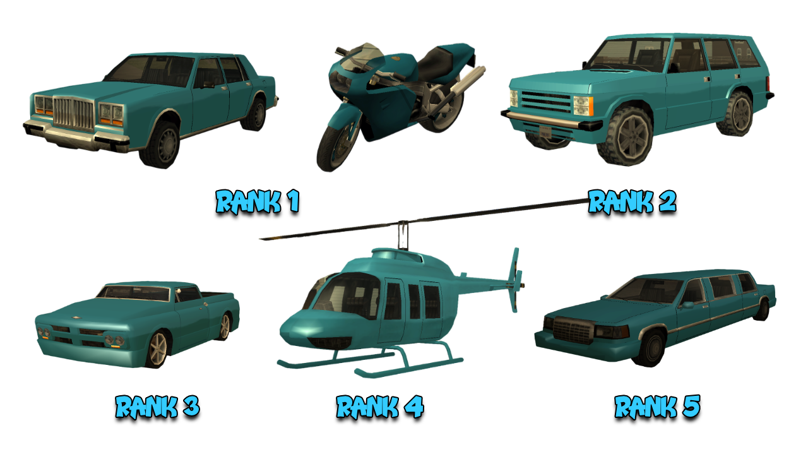

# Regulament 69 Pier Mobs

Pe langa acest regulament, toti membrii au obligatia de a respecta inclusiv [Regulamentul Serverului](../..) cat si [Regulamentul Gangurilor](../gang-rules.md).

## 1. Comenzile Factiunii

- [/f] - (rank 1) chatul gangului.
- [/fdeposit] - (rank 1) depozitezi bani in seiful gangului.
- [/fwithdraw] - (rank stabilit de lider) retragi bani din seiful factiunii.
- [/fputdrugs] - (rank 1) depozitezi droguri in seiful factiunii.
- [/fgetdrugs] - (rank 1) retragi droguri din seiful factiunii.
- [/turfs] - (rank 1) vizionezi teritoriile gangului pe harta.
- [/gc] - (rank 1) chatul aliantei.
- [/leavewar] - (rank 1) parasesti warurile optionale.
- [/guns] - (rank 1) iei arme la warurile optionale.
- [/fines] - (rank 1) lista cu jucatorii care au primit amenzi / tot aici se poate plati o amenda.
- [/stealers] - (rank 1) lista cu jucatorii care au furat vehiculele factiunii.
- [/tie] - (rank 3) legi o persoana care se afla in masina cu tine daca esti sofer.
- [/untie] - (rank 3) dezlegi persoana legata.
- [/tduty] - (rank 4 + Tester) te pui la datorie.
- [/backup] - (rank 4) chemi intariri la locatia ta.
- [/fvr] - (rank 5) respawnezi toate vehiculele factiunii.
- [/ftalkpower] - (rank 5) setezi rankul minim pentru a putea vorbi pe chatul factiunii.
- [/fwithdrawpower] - (Lider) modifici rankul de la care poate fi accesat seiful factiunii.
- [/fputmaterials] - (rank 1) depozitezi materiale in seiful factiunii.
- [/fgetmaterials] - (rank 1) retragi materiale din seiful factiunii.
- [/skins] - (rank 1) schimbi skinul de factiune.
- [/setgc] - (Lider) aplica o restrictie pe chatul factiunii.
- [/upcomingwars] - (rank 1) arata warurile ce urmeaza.
- [/order] - (rank 1) cumperi arme din HQ.
    - [/order 1] - (rank 1 / 350 mats) Desert Eagle.
    - [/order 2] - (rank 2 / 2850 mats) Desert Eagle, M4.
    - [/order 3] - (rank 3 / 5850 mats) Desert Eagle, M4, Rifle.
    - [/order 4] - (rank 4 / 6500 mats) Desert Eagle, M4, TEC-9, Combat Shotgun, Rifle.
- [/ft] - lista candidatilor online.
- [/togcomms] - (de)blocarea cailor de comunicare ale candidatului.

## 2. Skinurile Factiunii

<figure markdown="span">
    { width="800" }
</figure>

## 3. Vehiculele Factiunii

<figure markdown="span">
    { width=1000" }
</figure>

- 4 Greenwood - Rank 1.
- 2 FCR-900 - Rank 1.
- 4 Huntley - Rank 2.
- 1 Slamvan - Rank 3.
- 1 Maverick - Rank 4.
- 1 Stretch - Rank 5.

3.1 Pentru vehiculele de rank 4+ anuntati pe [/f] cand le luati.