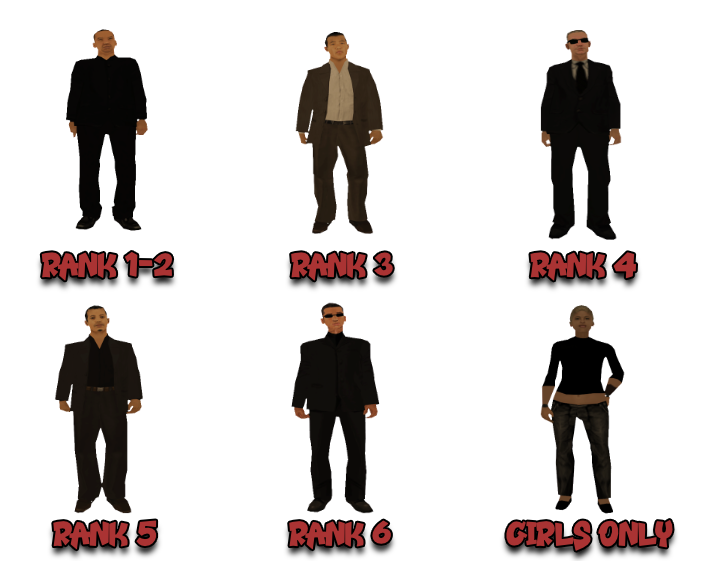

# Regulament Hitmen Agency

Pe langa acest regulament, toti membrii au obligatia de a respecta inclusiv [Regulamentul Serverului](../..) cat si [Regulamentul Factiunilor Pasnice si Mixte](../peaceful-and-mixt-faction-rules.md).

## 1. Comenzile Factiunii

- [/f] - vorbesti pe chatul factiunii.
- [/clothes] - pentru a schimba skinul, poate fi schimbat in casa, HQ sau intr-un magazin de haine.
- [/fvs] - pentru a spawna un vehicul al factiunii.
- [/fvr] - cu ajutorul acestei comenzi se respawneaza toate masinile factiunii (rank 5+).
- [/fdeposit] - adauga o suma de bani in seiful factiunii.
- [/fputdrugs] - depune droguri in seiful factiunii.
- [/fputmaterials] - depune materiale in seiful factiunii
- [/fgetdrugs] - cu ajutorul acestei comenzi puteti lua droguri in seiful factiunii.
- [/fgetmaterials] - cu ajutorul acestei comenzi puteti lua materiale in seiful factiunii.
- [/timestamp] - iti arata timpul in chat. Aceasta comanda trebuie sa fie activa mereu.
- [/blacklist [/bl]] - lista cu jucatorii de pe blacklist-ul factiunii. 
- [/tog Hitman Contracts] - activeaza/dezactiveaza mesajele legate de contracte.
- [/portable] - deschizi laptopul agentiei (trebuie sa fii conectat pentru a putea folosi comenzi specifice).
    - [MyContract] - arata detalii cu privire la tinta, precum: nume, ID, nivel, factiune daca e cazul, job, timpul de inchisoare daca e cazul.
    - [Gethit] - preiei un contract.
    - [Leavehit] - anulezi un contract.
    - [Order] - comanzi un pachet de arme in functie de rank.
        - Order 1: (rank 1) Knife, SD Pistol, MP5, Sniper.
        - Order 2: (rank 2+) Knife, SD Pistol, MP5, M4, Sniper.
        - Order 3: (rank 2+) Knife, SD Pistol, MP5, AK47, Sniper.
    - [Ranks] - afiseaza membrii online si rankul acestora.
    - [Undercover] - iti asigura identitatea secreta pentru realizarea unui contract.
    - [Logout] - te deconectezi de la laptopul agentiei.
- [/ft] - lista candidatilor online.
- [/togcomms] - (de)blocarea cailor de comunicare ale candidatului.

## 2. Skinurile Factiunii

<figure markdown="span">
    { width="800" }
</figure>

## 3. Vehiculele Factiunii

<figure markdown="span">
    { width=1000" }
</figure>

- 37 Sparrow - Rank 1.
- 3 Buffalo - Rank 1.
- 3 FCR-900 - Rank 2.
- 1 Sultan - Rank 3.
- 2 Maverick - Rank 4.

## 4. Efectuarea Contractelor

!!! example "Nota informativa"
    Pasii pentru a prelua un contract sunt urmatorii: [/portable], gethit, order, undercover, [/find].

4.1 Fiecare contract trebuie efectuat in mod Silent (silentios).

4.1.1 Modul Silent (silentios) reprezinta efectuarea unui contract de la mare distanta, dintr-un loc in care nu poti fi vazut de nimeni, cu Sniper.

4.2 Armele cu care puteti efectua un contract sunt: Sniper, SD Pistol si Knife (cutit).

4.3 Puteti efectua un contract folosind Knife sau SD Pistol doar atunci cand tinta se afla in casa / HQ-ul unei factiuni / HQ-ul unui clan / biz / Garaj PD / Training Room / Primarie sau Bunker. (sanctiune: demitere).

4.4.1 Finalizarea contractelor cu alte arme decat cele mentionate mai sus, ori folosirea armelor SD Pistol si Knife cand tinta nu este in casa / HQ-ul unei factiuni / HQ-ul unui clan / biz / Garaj PD / Primarie sau Bunker va duce la demiterea voastra cu 60 FP.

4.4 In cazul in care tinta dumneavoastra se afla intr-o casa cu spatele la perete sau este in miscare, neputand finaliza contractul cu Knife, aveti permisiunea de a folosi SD PISTOL. Cine este prins ca abuzeaza de aceasta arma o sa fie sanctionat cu Faction Warn la prima abatere si demitere cu 60 FP daca se repeta.

4.5 Atunci cand casa in care se afla tinta este incuiata, puteti folosi comanda [/ram] pentru a intra prin efractie.

4.6 In cazul tintelor aflate in HQ / Training Room, aveti posibilitatea de a efectua contractul in felul urmator: dati [/ram] daca tinta voastra se afla in HQ sau [/enter] daca tinta se afla in Training Room si efectuati contractul. In cazul in care este sedinta / antrenament, parasiti zona complet, asigurati-va ca nu va vede nimeni si dati [leavehit].

4.7 In cazul tintelor aflate in Bunker, aveti posibilitatea de a efectua contractul doar daca nu aveti wanted.

4.8 Agentilor le este strict interzis efectuarea contractelor in Jail, Poker sau orice fel de arena (Paintball, Gungame, Pubg, Race Arena etc.) (sanctiune: demitere).

4.9 Nu se pot efectua contracte pe tintele care sunt pe [/sleep]. 

4.10 Efectuarea contractelor la evenimente importante organizate de admini este strict interzisa (sanctiune: demitere).

4.11 Atunci cand aveti un contract nu aveti voie sa fiti insotiti de persoane care nu fac parte din Agentie.                         

4.12 Contractele efecutate cu Sniper de la o distanta mai mica de 150 metri vor fi sanctionate cu Faction Warn.

4.13 Este strict interzisa interactionarea de orice fel cu tinta (mesaje / telefoane / comunicare) sau sa divulgati date despre contract victimei sau oricarei alte persoane (sanctiune: demitere).

4.14 Este strict interzisa interactionarea cu orice alt jucator in timpul unui contract (sanctiune: Faction Warn).

4.15 Fraudarea sau ajutarea unui coleg sa fraudeze raportul de activitate este strict interzisa (sanctiune: demitere).

4.16 Un agent nu are voie sa-si dezvaluie identitatea cat timp are UNDERCOVER ON (sanctiune: Faction Warn).

4.17 Va este permis ca in timpul contractelor sa aveti cu voi colegi pe G.

### Dezvaluire Identitate + Sanctiune

- folosirea comenzii [/emergency] in cazul in care sunteti atacati (sanctiune: Faction Warn).
- folosirea comenzii [/q] sau [/quit] cand sunteti UNDERCOVER ON si in preajma altor jucatori (sanctiune: Faction Warn).

### Dezvaluire Identitate FARA Sanctiune

- atunci cand un jucator foloseste comanda [/tazer] & [/confiscate] pe el.

!!! danger "Important"
    In acest caz agentul este obligat sa plece cat mai repede posibil. Daca se interactioneaza cu acesta pe orice chat, se va aplica sanctiunea pentru "Interactionare cu jucatorii in timpul contractului" (sanctiune: Faction Warn).

### Nedezvaluire Identitate

- folosirea comenzii [/eject] cand un jucator se urca neinvitat in vehiculul factiunii cu care efectuati contractul.   

## 5. Leavehit si Gethit

5.1 Fiecare agent isi poate procura un contract folosind comanda [/portable] - gethit.

5.2 Dupa efectuarea unui contract trebuie sa asteptati o perioada de timp (aceasta perioada depinde de distanta si de modul cum a fost efectuat contractul) pana puteti lua alt contract. Aceste perioade si moduri de efectuare sunt:

- pentru contractul efectuat intre 150.0m si 199.9m, timpul de asteptare este de 15 minute.
- pentru contractul efectuat intre 200.0m si 249.9m, timpul de asteptare este de 10 minute.
- pentru contractul efectuat intre 250.0m si 299.9m sau in cazul in care tinta se sinucide (de la 150.0m pana la 299.9m), timpul de asteptare este de 5 minute.
- daca contractul a fost efectuat de la o distanta cel putin egala cu 300m sau cu Knife/SD Pistol, agentul poate sa ia automat un alt contract.

### Leavehit

- un agent are posibilitatea sa foloseasca comanda [leavehit] cand doreste, cu un cooldown de 5 minute intre fiecare leavehit.
- in urma utilizarii comenzii [leavehit], undercoverul devine OFF. Prin urmare, inainte sa folositi aceasta comanda, asigurati-va ca nu este nimeni in jurul vostru care sa nu faca parte din agentie.

### Gethit

- un agent are posibilitatea sa foloseasca comanda [gethit] cand doreste sa-si faca raportul, nicidecum ca sa profite de undercover.

## 6. Undercover

6.1 Cand un agent are contract, el are obligatia sa se asigure ca este sub acoperire (UNDERCOVER ON).

6.2 Undercoverul dispare la un minut dupa efectuarea unui contract.

6.3 Agentii nu au voie sa abuzeze de Undercover (sanctiune: Faction Warn la prima abatere, demitere la urmatoarea).

!!! danger "Important"
    Comanda "undercover", in urma preluarii unui contract cu [gethit], se va tasta doar cand sunteti siguri ca nu exista alti jucatori care nu fac parte din agentie in apropierea voastra care sa va vada. Desigur, in urma efectuarii contractului, de asemenea, nu trebuie ca cineva sa fie in preajma cand undercoverul devine OFF (sanctiune: Faction Warn).

### Abuz Undercover

- atunci cand iti pui noss/hydra pe masina si mergi intentionat la un politist si incerci sa il enervezi / stresezi bagandu-te in el avand UNDERCOVER ON.
- atunci cand, folosind un vehicul cu roti, treci repetitiv si abuziv prin radarul unui politist fara motiv avand undercover.

### Neabuz Undercover

- atunci cand mergi dupa tinta, esti somat de politist si nu raspunzi la somatia acestuia, nebagandu-l in seama.
- atunci cand un politist iti spune sa scoti Undercoverul, si alegi sa nu o faci, fugind si riscand wanted.
- atunci cand folosesti un vehicul cu roti pentru efectuarea contractului si treci prin radar iar politistul te someaza sa iti dea amenda si nu il bagi in seama.

## 7. Conflicte

7.1 Orice conflict cu orice membru ramane in interiorul factiunii si va fi rezolvat de catre Lider sau Sublider.

7.2 Pentru o rezolvare corecta sunteti obligati sa faceti poze care sa cuprinda toata situatia.

7.3 Daca un membru comenteaza Liderului sau Subliderului, acesta va fi sanctionat cu Faction Warn.

## 8. Amenzi

- AFK HQ (Interior / exterior) in “i“ daca blocheaza accesul jucatorilor - 25,000$
- Spam pe [/f] - 30,000$
- Caps pe [/f] - 30,000$
- Intarziere sedinta / Antrenament / Activitate anuntata - 30,000$
- Vorbit neintrebat in timpul Sedintei / Antrenamentului - 25,000$
- AFK in timpul unei activitati - 35,000$
- Parcarea masinilor in curtea HQ-ului astfel incat sa deranjeze circulatia vehiculelor factiunii. - 50,000$, a doua abatere Avertisment Verbal  + amenda 50,000$
- FVR neanuntat - 50,000$ + Avertisment Verbal sau Faction Warn in functie de gravitate.
- FVR cand a anuntat alt coleg rank 5+ : 50,000$

!!! example "Nota informativa"
    Daca se dovedeste ca s-a dat [/fvr] special pentru a incurcat membrul, se aplica sanctiunea pentru abuz de [/fvr].

## 9. Blacklistul

9.1 Puteti face drive-by ca pasager asupra jucatorilor aflati pe blacklist.

9.2 Puteti folosi Sultan sau Maverick la urmarirea jucatorilor aflati pe blacklist (pentru Maverick trebuie sa fiti insotiti de un rank 4).

9.3 Explicati scurt si clar motivul uciderii unui jucator aflat pe blacklist daca intreaba de ce a fost omorat.

9.4 In urmarirea unui jucator aflat pe blacklist anuntati-l ca e pe blacklist si ca poate plati blacklistul prin comanda [/mybl].

## 10. The Silent One

10.1 The Silent One (TSO) este o competitie OBLIGATORIE pentru agentii de rank 1-5 ce se desfasoara saptamanal. Participarea se face pe forum in topicul [The Silent One](https://forum.b-zone.ro/topic/31863--).

10.1.1 Neparticiparea la concurs sau postarea unei poze incorecte se sanctioneaza cu Avertisment Verbal la prima abatere, Faction Warn la urmatoarea.

10.1.2 Pentru membrii cu raport optional sau inactivitate, participarea la TSO este optionala.

10.2 Ca un contract TSO sa fie considerat corect trebuie sa indeplineasca urmatoarele conditii:

- distanta minima de 300 metri.
- poza sa fie cu tinta pusa.
- timestamp-ul trebuie sa fie activat, folositi [/timestamp] pentru a-l activa.
- sa fiti pe aceeasi linie pe minimap cu tinta ([asa da](https://imgur.com/a/KJrHsqO) / [asa nu](https://imgur.com/a/jgKWSvV)).
- distanta de pe [/find] sa corespunda cu distanta de la mesajul informativ ca ati realizat contractul (exista totusi cateva exceptii, vezi regula 10.2.1).

!!! example "Nota informativa"
    Aveti aici [cateva exemple](https://imgur.com/a/RkMvfUC) de contracte corecte, pentru a va da seama cum ar trebui sa arate.

10.2.1 Exista situatii sa nu corespunda distanta de pe [/find] cu cea de realizare a contractului atunci cand tinta e in miscare. Contractul va fi considerat valid cat timp pe minimap tinta se afla pe aceeasi linie cu voi ([exemplu](https://imgur.com/a/mzmuBra)).

10.2.2 Exista situatii sa nu se vada tinta dupa ce o omorati. Contractul va fi considerat valid cat timp pe minimap tinta se afla pe aceeasi linie cu voi ([exemplu](https://imgur.com/a/viBDRbF)).

10.2.3 Damage-ul informativ nu este obligatoriu, insa este recomandat sa-l aveti activat.

10.3 Contractele pentru editia curenta de TSO se posteaza DOAR dupa ce sunt postate rezultatele editiei precedente (sanctiune: Avertisment Verbal).

10.4 Puteti edita postarea de pe forum pentru a modifica poza cu contractul, atata timp cat va permite forumul optiunea de editare. Daca aceasta nu e disponibila puteti discuta cu liderul sa va editeze postarea daca doreste.

10.5 Nu aveti voie sa postati mai mult de un contract la o editie de TSO. In acest caz se va lua in considerare doar primul contract postat.

10.6 TSO incepe Luni de la ora 00:00 si se incheie Duminica la ora 23:59. Sunt considerate valide doar contractele efectuate si postate in saptamana editiei respective.

## 11. Altele

11.1 Atunci cand un agent are Wanted 6 (fara drept de predare), aceste are obligatia de a nu sta in HQ deoarece exista posibilitatea de a fi si alte victime.

11.2 Este recomandat ca agentii sa faca poza la fiecare contract indeplinit pentru a nu se crea conflicte, sau in cazul in care vor fi reclamati.

11.3 Folosirea armelor silent, Sniper si Knife pentru auto-aparare (pe COPS) va fi sanctionata cu demitere cu FP.

11.4 Absentarea de la activitati sau sedinta fara invoire va fi sanctionata cu Faction Warn. Intarzierea la activitati sau sedinte se sanctioneaza in felul urmator:

- intarziere sub 10 minute - nimic
- intarziere de 10-20 de minute - Avertisment verbal (AV)
- intarziere de 20-30 minute - Avertisment verbal (AV) + 50.000$ amenda
- intarziere de 30+ minute - Faction Warn (FW)

11.5 Deathmatch-ul fara a avea contract va fi sanctionat cu Faction Warn.

11.6 Se poate dezactiva/activa chatul factiunii doar cu acordul unui Sublider sau al Liderului (sanctiune: Faction Warn).