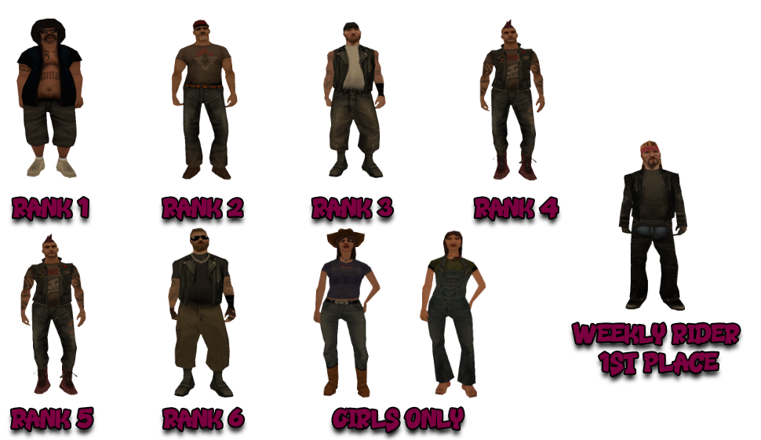

# Sons of Anarchy Rules

Besides these rules, all members are obligated to respect both the [Server Rules](../..) as well as [Peaceful Faction and Mixt Rules](../peaceful-and-mixt-faction-rules.md).

## 1. Faction Commands

- [/f] - you're speaking on the faction chat.
- [/clothes] - to change your skin, it can be done at home, HQ, or at a clothing store.
- [/fvs] - to spawn a faction vehicle.
- [/fvr] - with this command, all faction vehicles respawn (rank 5+).
- [/fdeposit] - add a sum of money to the faction's safe.
- [/fputdrugs] - deposit drugs into the faction's safe.
- [/fputmaterials] - deposit materials into the faction's safe.
- [/fgetdrugs] - with this command, you can take drugs from the faction's safe.
- [/fgetmaterials] - with this command, you can take materials from the faction's safe.
- [/timestamp] - shows the time in the chat. This command must always be active.
- [/blacklist [/bl]] - list of players on the faction's blacklist.
- [/work] - to start stealing a personal or police motorcycle.
- [/picklock] - to break into a locked personal motorcycle.
- [/order] - to procure various weapon packages.
- [/extort] or [/ext] - to extort a civilian wearing one of the faction skins.
- [/imp] - to see online players wearing a Sons of Anarchy skin.
- [/ft] - list of online candidates.
- [/togcomms] - (un)lock the communication channels of the candidate.

## 2. Faction Skins

<figure markdown="span">
    { width="800" }
</figure>

## 3. Faction Vehicles

<figure markdown="span">
    { width=1000" }
</figure>

- 5 Wayfarer - Any rank.
- 15 Freeway - Rank 2.
- 4 Sanchez - Rank 3.
- 2 FCR-900 - Rank 4.
- 3 Berkley's RC Van - Rank 4.
- 1 Maverick - Rank 4.
- 1 Utility - Rank 5.

3.1 Faction vehicles can be used by members anytime they need, either for activity reports or personal reasons.

3.2 Once you're done with faction vehicles, they should be respawned (either by exploding, throwing them into water, or by requesting a respawn from a colleague using [/fvr]).

## 4. General Rules

4.1 You are not allowed to use faction commands for personal purposes or for fun (sanction: Faction Warn).

4.2 Members are allowed to use any job, whether legal or illegal. The only situation in which members must hold a specific job is when a Rank 5+ member requests it for a special activity (sanction: Faction Warn).

## 5. Faction Chat

5.1 Members of any Rank are not allowed to spam the [/fvs] command (sanction: Faction Warn).

5.2 Members of Rank 5+ are obligated to inform members on [/f] at least 10 seconds before using the [/fvr] command (sanction: Verbal Warning).

5.3 The [/ftalkpower] command will only be used with well-founded reasons (e.g., activities, stopping a conflict on [/f], etc.) (sanction: Faction Warn for the first offense, Rank Down if repeated).

5.4 Toggling the faction chat is only permitted with the agreement of a sub-leader or the leader (sanction: Faction Warn).

## 6. Stealing Motorcycles

6.1 Sons of Anarchy members can use [/work] and [/picklock] to steal personal and police motorcycles. The motorcycle models that can be stolen are as follows: Freeway, PCJ-600, Sanchez, Quad, FCR-900, NRG-500, BF-400, Wayfarer, Faggio, Pizzaboy, Police HPV-1000, Police NRG-500.

6.1.1 Personal and police motorcycles can be stolen without Sons of Anarchy members receiving wanted level. The following conditions must be met:

- Rank 1: they will receive wanted if there is at least 1 player within a radius of 300m from the theft.

- Rank 2: they will receive wanted if there is at least 1 player within a radius of 250m from the theft.

- Rank 3: they will receive wanted if there is at least 1 player within a radius of 200m from the theft.

- Rank 4: they will receive wanted if there are at least 2 players within a radius of 150m from the theft.

- Rank 5/6: they will receive wanted if there are at least 2 players within a radius of 100m from the theft.

6.2 Stolen motorcycles can be delivered to Sons of Anarchy garages in each city. The locations are as follows:

- Los Santos [physical position](https://imgur.com/AYWg0Y6), [map position](https://imgur.com/IGyzVOK)
- Las Venturas [physical position](https://imgur.com/oC9Z6E2), [map position](https://i.imgur.com/M8T8eSQ.png)
- San Fierro [physical position](https://imgur.com/Bbe932L), [map position](https://imgur.com/SQnsFnr)

6.3 You are not allowed to ask players to allow you to steal their motorcycles (sanction: Faction Warn).

6.4 You are not allowed to steal faction members' personal motorcycles from secondary accounts (sanction: Faction Warn for the thief and the accomplice if there is evidence).

6.4.1 If this action is repeated multiple times, it may be considered as report fraud (sanction: dismissal).

6.5 You are not allowed to ask players to assist you in any way during a report (sanction: Faction Warn or dismissal depending on the case). Two examples of situations that are not permitted:

- asking players to spawn their motorcycles so you can steal them.
- asking players to move their motorcycles somewhere else so you can steal them without receiving wanted level.

6.6 You are not allowed to attack players from whom you are stealing motorcycles. Theft can be completed successfully without engaging in DM, except when you are attacked first, and you can defend yourself (sanction: Faction Warn).

## 7. Extorsion

7.1 Sons of Anarchy members can use [/extort] or [/ext] on any civilian using one of the faction skins to steal money, materials, and drugs from them.

7.2 You are not allowed to ask players to allow you to extort them (sanction: Faction Warn).

7.3 You are not allowed to extort faction members from secondary accounts (sanction: Faction Warn for the extorter and the accomplice if there is evidence).

7.4 You are not allowed to attack players you are extorting. Extortion can be successfully completed without engaging in DM, except when you are attacked first, and you can defend yourself (sanction: Faction Warn).

## 8. Fines

8.1 If you stay AFK inside/outside the HQ in "i" and block player access - $25,000

8.2 Spamming on [/f] is not allowed - $30,000

8.3 Using caps on [/f] is not allowed - $30,000

8.4 If you're late for a announced meeting/training/activity - $30,000

8.5 If you speak without permission during a meeting/training - $25,000

8.6 If you are AFK during an activity - $35,000

8.7 Parking cars in the HQ courtyard in a way that disrupts faction vehicle traffic - $50,000, Verbal Warning if it persists + $50,000

8.8 If you use the [/fvr] command without announcing - $50,000 + Verbal Warning or Faction Warn depending on severity, incidents

8.9 If you use the [/fvr] command after a Rank 5+ colleague has already announced it - $50,000
