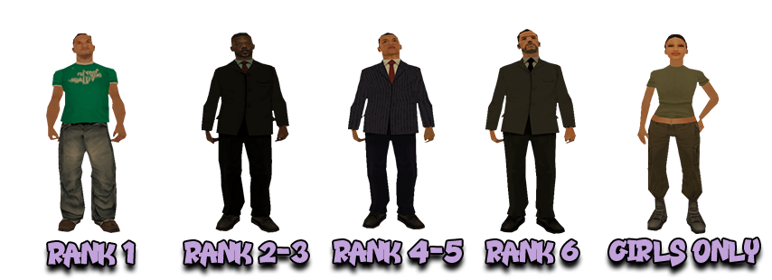
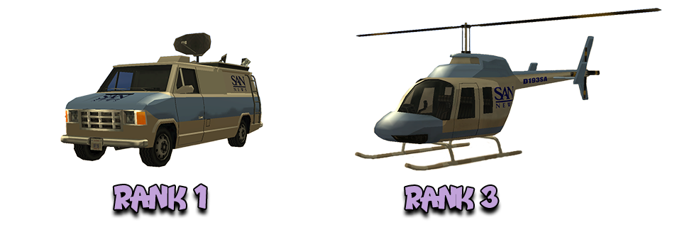

# News Reporters Rules

Besides these rules, all members are obligated to respect both the [Server Rules](../..) as well as [Peaceful Faction and Mixt Rules](../peaceful-and-mixt-faction-rules.md).

## 1. Faction Commands

- [/f] - to be able to discuss with faction members.
- [/duty] - with this command you have the possibility to use the rest of the commands.
- [/news] - with this command you can publish announcements.
- [/papers] - with this command you can view written newspapers.
- [/live] - with this command you can go live alone or with multiple participants.
- [/livemembers] - with this command you can see the participants in the live.
- [/l] - with this command you can write on the global live chat.
- [/endlive] - with this command you can end an interview.
- [/deliver] - with this command you can sell a newspaper.
- [/heal] - with this command you can replenish your life (100) inside the HQ.
- [/fdeposit] - adds a sum of money to the faction's safe.
- [/fwithdraw] - with this command, money can be withdrawn from the faction's safe (rank 6+).
- [/ftalkpower] - with this command, a chat usage restriction can be applied based on rank within the faction.
- [/fvr] - with this command, all faction vehicles respawn (rank 5+).
- [/fvs] - to spawn a faction vehicle.
- [/fines] - with this command, you can see the faction's fines.
- [/fputdrugs] - deposits drugs into the faction's safe.
- [/fputmaterials] - deposits materials into the faction's safe.
- [/fgetdrugs] - with this command, you can take drugs from the faction's safe.
- [/fgetmaterials] - with this command, you can take materials from the faction's safe.
- [/timestamp] - shows the time in chat. This command must always be active.
- [/blacklist [/bl]] - list of players on the faction's blacklist.
- [/onduty] - displays a list of all online members, with on-duty members highlighted in green (Rank 3+).
- [/ft] - list of online candidates.
- [/togcomms] - (un)lock the communication channels of the candidate.

## 2. Faction Skins

<figure markdown="span">
    { width="800" }
</figure>

2.1 News Reporters members who are on the legends list and return to the faction can wear the Leader skin.

## 3. Faction Vehicles

<figure markdown="span">
    { width=1000" }
</figure>

- 12 News Van - Rank 1.
- 1 News Chopper - Rank 3.

3.1 Members of the News Reporters faction must announce each time they take over the News Chopper vehicle on the [/f] chat (sanction: Verbal Warning).

3.2 Members of the News Reporters faction can use faction vehicles for personal use and can paint faction vehicles any color.

## 4. General Rules

4.1 As long as the leader or faction News Reporters subleaders are not online, you must respect the highest active rank (sanction: Faction Warn).

4.2 You must always have the [/timestamp] command activated to prevent mistakes, to provide clear evidence in case of complaints (sanction: Verbal Warning).

4.3 Using the [/tog] command in faction chat is prohibited, except in cases where you are taking a test or have received approval with a valid reason (sanction: Faction Warn).

4.4 If a member of the News Reporters faction files complaints in an abusive manner, the member will be warned in advance by the leader to stop sending PMs, and these will be ignored. Subsequent infractions will be penalized with a Faction Warn and even dismissal (if necessary).

## 5. The [/news] Command

### Specifications

5.1.1 The command [/news] is used to send the following types of announcements:

- informative announcements (1): strictly informative announcements regarding the News Reporters faction as well as important matters about the server.
- free announcements (2): announcements given at each fixed hour, based on [/sms] sent by online players at that time.
- roleplay announcements (3): announcements promoting roleplay acquisitions, updates, and community events, territorial achievements within gangs, and others.
- package announcements (4): special announcements purchased by server players for personal purposes.

5.1.2 - Details about the [/news] command:

- any incomplete / incorrect announcement will be penalized - $50,000 / Verbal Warning / Faction Warn.

- when publishing an announcement, notify on the faction chat [/f] 5 - 20 seconds before publishing it on [/news] - $50,000 / Verbal Warning.

- all announcements are published at a 3-minute interval, with a one-minute break between colleagues' announcements - Verbal Warning / Faction Warn./news] command will not be used abusively - Dismissal with 60/60 Faction Punish and 14-day ban.

- the [/news] command will not be used for other types of announcements without the Leader's approval - Faction Warn.

- the "Word. Word" rule and the "word, word" rule will be respected in the [/news] command - $25,000 / Verbal Warning / Faction Warn.

- at the end of the announcement on the [/news] command, "." (period) or "!" (exclamation mark) will be placed - $25,000 / Verbal Warning / Faction Warn.

- other available commands and IDs appearing on the [/news] command will be in the form of [/sms ID] and [/command] respectively - $25,000 / Verbal Warning / Faction Warn.

- within announcements of types (1), (3), and (4), the maximum allowed lines is two per announcement - Faction Warn.

- announcements of types (1), (3), and (4) can be made during a live broadcast / show / contest, but not during free announcements - Verbal Warning / Faction Warn.

### Informative News

5.2.1 Informative announcements are those announcements strictly related to the game, and informative announcements can be sent about:

- server locations.
- existing commands (excluding commands with vulgar content, such as [/wank], [/blowjob], or [/fucku], among others).
- information and tips.
- faction recruitments.

5.2.1.1 Informative announcements about vulgar commands, such as [/wank], [/blowjob], etc. are not allowed (punishment: Faction Warn).

5.2.2 An informative announcement must have a minimum of 60 characters (sanction: Verbal Warning for the first offense, Faction Warn for subsequent ones).

5.2.3 The informative announcements you publish on [/news] must vary. Do not publish the same announcement multiple times in one day (sanction: Verbal Warning for the first offense, Faction Warn for subsequent ones).

5.2.4 Abbreviations and acronyms are prohibited in informative announcements, exceptions: city names and faction names (sanction: Verbal Warning for the first offense, Faction Warn for subsequent ones).

5.2.5 Informative announcements related to: non-existent locations or unattainable activities are prohibited (sanction: Faction Warn).

5.2.6 Publishing a longer announcement can be done in two lines as follows:

- the first line must have a minimum of 90 characters, maximum of 109 characters.
- the second line must have over 60 characters and should not greatly exceed the first line (10+ characters).

!!! danger "Important"
    Violation of the above 5.2.6 rule will be penalized (sanction: Verbal Warning for the first offense, Faction Warn for subsequent ones).

### Free News

5.3.1 Free announcements are those announcements given at a fixed time, based on [/sms] received from players who want to sell / buy / exchange a personal item.

5.3.2 Members of the News Reporters faction reserve the right to ignore announcements from players on the faction blacklist during free announcement sessions.

5.3.3 The list of members wishing to participate in free announcements will always be made after xx:55:00 (sanction: Verbal Warning for the first offense, Faction Warn for subsequent ones).

- reporters are required to give a message like the following on the faction chat [/f] "Anyone willing to participate in Free Announcements please type [/f]".
- the list will be composed of one member designated to give start + stop for the session, and colleagues who will assist.
- violation of the above rule / arguments between those who want to make the list will be penalized with Faction Warn.

5.3.4 The member who creates the list for free announcements, whether they are rank 1-2 or rank 3+, is automatically designated start + stop.

- if the reporter designated start + stop assigns this function to another participant without their consent, they are penalized with Faction Warn.
- if the participant refuses the start + stop function, they will not be penalized.
- if the designated start + stop reporter encounters issues before the start of the free announcement session, the session will be canceled, or another start + stop reporter will be sought.

5.3.5 Duties of a start + stop member:

- they are always obligated to put their ID first.
- they must obtain the IDs of other participants, if necessary.
- they will write a test announcement on the faction chat [/f] for members to verify if their IDs are correctly written.
- between the times xx:06:20 - xx:06:40, they are obligated to announce on the faction chat [/f] the end of the free announcement session.
- between the times xx:06:50 - xx:07:10, they are obligated to announce on [/news] the end of the free announcement session.

!!! danger "Important"
    Violation of the above duties will be penalized (sanction: Verbal Warning for the first offense, Faction Warn for subsequent ones).

5.3.6 In a free announcement session, announcements about the following are not allowed:

- personal items that cannot be obtained through the command [/trade], exceptions: licenses, release warrants, and newspapers.
- illegal personal items, whether obtainable or not through the command [/trade], such as drugs, weapons, and materials.
- promotion of events organized through [/requestevent] or other methods.
- activities such as [/rob] or [/bunker].

!!! danger "Important"
    Violation of the above rules will be penalized (sanction: Verbal Warning for the first offense, Faction Warn for subsequent ones).

    The name of the sender of [/sms] will be written exactly as it appears in-game (sanction: Verbal Warning for the first offense, Faction Warn for subsequent ones). 
    Before publishing an announcement, you are required to verify the player who will send [/sms] (sanction: Verbal Warning / Faction Warn). 
    Vehicle names and businesses will always be capitalized (sanction: $50,000 / Verbal Warning).

5.3.7 The following abbreviations are allowed:

- location names: LS (Los Santos) / SF (San Fierro) / LV (Las Venturas) / HQ (Headquarter).
- faction names: NR (News Reporters) / LVPD (Las Venturas Police Department) / LVSI (Las Venturas School Instructors).
- business names: CNN (Cable News Network) / PNS (Paint'n Spray) / GS (Gun Shop).

5.3.8 A maximum of 5 reporters can participate in a free announcement session (sanction: Faction Warn).

5.3.9 The free announcement session will begin on [/news] immediately after payday (sanction: $25,000 / Verbal Warning / Faction Warn).

- starting model for free announcements when there are a maximum of 4 reporters: Free announcements have begun, [/sms 120], [/sms 250], [/sms 340], [/sms 490].
- starting model for free announcements when there are 5 reporters: Free announcements, [/sms 120], [/sms 250], [/sms 340], [/sms 490], [/sms 510].

5.3.10 During the free announcement session, only those supporting the session speak on the faction chat [/f] (sanction: $50,000 / Verbal Warning / Faction Warn).

5.3.11 It is prohibited for a reporter to post the same announcement from a player multiple times on [/news], with the announcement being identical (sanction: Verbal Warning for the first offense, Faction Warn for subsequent ones).

5.3.12 Members of the News Reporters faction reserve the right to ignore announcements from players on the faction's blacklist during the free announcement session.

5.3.13 You are allowed to send a message on [/news] confirming the continuation of the free announcement session only once after xx:03:30 (sanction: Verbal Warning for the first offense, Faction Warn for subsequent ones).

5.3.14 The minimum amount for selling / buying a personal item is $1,000 depending on the case (sanction: Verbal Warning for the first offense, Faction Warn for subsequent ones).

5.3.15 Reporters have the right to promote their goods through a single announcement during a free announcement session (sanction: Verbal Warning for the first offense, Faction Warn for subsequent ones).

5.3.16 A reporter is entitled to provide only one announcement for a single faction colleague during a free announcement session (sanction: Verbal Warning for the first offense, Faction Warn for subsequent ones).

### Roleplay News

5.4.1 Roleplay announcements are those announcements through which we promote advancements in positions (including the subleader position), updates, and events within the community, territorial achievements within gangs, and much more.

5.4.2 You can send roleplay announcements for:

- improvements made to the server.
- advancements in positions (including the sub-leader position).
- discounts on [/shop] and job of the day.
- final results from wars (only those from the previous day or the current day),
- the most active player on [/goldaward].

5.4.3 Roleplay announcements about subjects unrelated to the server's situation, unrealistic announcements, or those not of interest to players are prohibited (sanction: Faction Warn).

5.4.4 Roleplay announcements can be given in one line or two lines, but the first line must be longer than the second.

- the first line must have a minimum of 90 characters, and the second line must have a minimum of 60 characters (sanction: Faction Warn).

5.4.5 Some roleplay announcements have a limited validity, as follows:

- the relevance of an announcement disappears after 48 hours for territorial achievements within gangs.
- the relevance of an announcement disappears after 48 hours for advancements in positions (including the sub-leader position).
- the relevance of an announcement disappears after 72 hours for server updates.

!!! danger "Important"
    Breaking the rule 5.4.5 above will be sanctioned (sanction: Verbal Warning for the first offense, Faction Warn for subsequent offenses).

### Package News

5.5.1 Package announcements are those announcements purchased by the clients of the News Reporters faction, in the specific topic for these announcements.

5.5.2 Examples of package announcements:

- Ionel is selling an Infernus vehicle. He is waiting for offers in-game or on the website!
- Nowhere to spend your free time? Jizzy LV awaits you with an entrance fee of only $50.

5.5.3 Package announcements are randomly distributed to faction members, and you are not allowed to refuse the packages distributed to you (sanction: Faction Warn).

5.5.4 A reporter can send a maximum of 10 package announcements between two paydays (sanction: Faction Warn).

5.5.5 The time interval during which announcements from a package can be published is 09:00 - 02:00 (sanction: Verbal Warning for the first offense, Faction Warn for subsequent offenses).

5.5.6 It is forbidden to change the package announcement at your discretion or without the leader's approval (sanction: Faction Warn).

5.5.7 Exceeding the number of announcements in the package is strictly prohibited (sanction: Verbal Warning for the first offense, Faction Warn for subsequent offenses).

5.5.8 You are not allowed to contact the package beneficiary with the purpose of requesting an additional amount of money to send the announcements (sanction: Faction Warn).

5.5.9 You have 24 hours to post the package in the "[News Reporters - Package Announcements Evidence](https://forum.b-zone.ro/topic/190845--)" topic after it's completed (sanction: Faction Warn).

5.5.10 Those who fail to complete the package of announcements by the deadline will receive a Verbal Warning if they've completed 50% of the package, or a Faction Warn if they've completed less than 50% of the package.

## 6. The [/live] Command

### Specifications

6.1.1 The [/live] command is used for the following types of live broadcasts:

- interviews (1): can only be conducted by News Reporters faction members with rank 3+ in the faction.
- shows (2): can only be conducted by News Reporters faction members with rank 4+ in the faction.
- contests (3): can only be conducted by News Reporters faction members with rank 3+ in the faction.

6.1.2 For more information about the [/live] command, you can access the topic [News Reporters - Live Broadcast Details](https://forum.b-zone.ro/topic/242420--).

6.1.3 Details about the [/live] command:

- when you start broadcasting, announce it on the faction chat [/f] 1 - 2 minutes before going live on [/live] (sanction: $25,000 / Verbal Warning / Faction Warn).

- the [/live] command cannot be used during a free announcement session (sanction: Faction Warn).

- the [/live] command must not be abused (sanction: dismissal with 60/60 Faction Punish and 14-day ban).

- the [/live] command must not be used for other types of broadcasts without leader approval (sanction: Faction Warn).

- on the [/live] command, the "word. Word" rule and the "word, word" rule must be followed (sanction: $25,000 / Verbal Warning / Faction Warn).

- at the end of any statement on the [/live] command, a "." (period) or "!" (exclamation mark) must be added (sanction: $25,000 / Verbal Warning / Faction Warn).

- other available commands, as well as the IDs that appear on the [/live] command, must be in the format [/sms ID] and [/command] (sanction: $25,000 / Verbal Warning / Faction Warn).

- you can write statements on multiple lines when you are on [/live], but this must be indicated by [...] at the end of the first line and at the beginning of the next line (sanction: $25,000 / Verbal Warning / Faction Warn).

6.1.4 Lack of proof with [/livemembers] for any type of show will be sanctioned with a Verbal Warning on the first offense, and a Faction Warn for subsequent offenses.

### Interviews

6.2.1 Interviews represent a service offered by the News Reporters faction. Interviews are composed of real-life questions, virtual-life questions, and questions from the audience. Interviews can only be conducted by News Reporters faction members with a rank of 3+ in the faction.

6.2.2 For more information about interviews, you can access the topic [News Reporters - Live Broadcast Details](https://forum.b-zone.ro/topic/242420--).

6.2.3 The price of an interview is always $20,000 / person (sanction: Verbal Warning for the first offense, Faction Warn for subsequent offenses).

- reporters always benefit from interviews at the price of $1 / person (sanction: Verbal Warning for the first offense, Faction Warn for subsequent offenses).

6.2.4 Interviews can only be conducted with a previously accepted interview request (sanction: Faction Warn).

6.2.5 It is forbidden to conduct an interview with a player after their interview request has expired (sanction: Faction Warn).

6.2.6 It is not allowed to conduct an interview with one or more players who are on the faction's blacklist (sanction: Faction Warn).

6.2.7 The maximum number of participants in an interview is 7 participants (sanction: Faction Warn).

6.2.8 The maximum duration of an interview is 60 minutes (sanction: Verbal Warning for the first offense, Faction Warn for subsequent offenses).

6.2.9 Before starting an interview, you have the obligation to clarify to the guests that they must adhere to the rules imposed on [/l].

- no insults or grammatical errors.
- no emoticons or abbreviations.
- avoid excessive caps-lock and spam.
- no mockery or teasing.

!!! danger "Important"
    Lack of clarification for the [/l] rules for your guests is punished with Verbal Warning on the first offense, Faction Warn for subsequent offenses.
    You are required to stop the interview as soon as the guests start to disrespect the imposed rules (sanction: Verbal Warning on the first offense, Faction Warn for subsequent offenses).

6.2.10 You have 48 hours to post evidence of an interview after its conclusion in the specific topic (sanction: Verbal Warning on the first offense, Faction Warn for subsequent offenses).

6.2.11 If a guest is removed from the interview by an Admin for a reason related to the [/l] command, they cannot be re-invited to the interview (sanction: Faction Warn).

6.2.12 Lack of proof with a minimum of 3 and a maximum of 5 pictures from the interview will be sanctioned with a Verbal Warning on the first offense, and a Faction Warn for subsequent offenses.

### Shows

6.3.1 Shows represent a service offered by the News Reporters faction. Shows can cover various topics, such as: Yes/No or Smash or Pass. Shows can only be hosted by News Reporters faction members with a rank of 4+ who also have the Qualified Reported role (sanction: Faction Warn).

6.3.2 For more information about shows, you can access the topic [News Reporters - Live Broadcast Details](https://forum.b-zone.ro/topic/242420--).

6.3.3 The price of a show is always $20,000 per person (sanction: Verbal Warning for the first offense, Faction Warn for subsequent offenses).

- reporters always benefit from shows at the price of $1 per person (sanction: Verbal Warning for the first offense, Faction Warn for subsequent offenses).

6.3.4 The maximum number of participants in a show is 3 participants (sanction: Faction Warn).

6.3.5 It is not allowed to host a show with a player or multiple players who are on the faction's blacklist (sanction: Faction Warn).

6.3.6 The maximum duration for a show is 60 minutes (sanction: Verbal Warning for the first offense, Faction Warn for subsequent offenses).

6.3.7 Before starting a show, you are obligated to clarify to the guests that they must adhere to the rules set on [/l].

- no insults or grammatical errors.
- no emoticons or abbreviations.
- avoid excessive caps-lock and spam.
- no mockery or teasing.

!!! danger "Important"
     You are required to stop the show as soon as the guests start to disrespect the imposed rules (sanction: Verbal Warning on the first offense, Faction Warn for subsequent offenses).

6.3.8 You have 48 hours to post evidence of a show after its conclusion in the specific topic (sanction: Verbal Warning for the first offense, Faction Warn for subsequent offenses).

6.3.9 If a guest is removed from a show by an Admin for a reason related to the [/l] command, they cannot be re-invited to the show (sanction: Faction Warn).

6.3.10 Lack of proof with the title of the organized show will be sanctioned with a Verbal Warning on the first offense, and a Faction Warn for subsequent offenses.

### Contests

6.4.1 Contests represent a service offered by the News Reporters faction. Contests can address various themes, such as Countries & Capitals, Automobiles, or History. Contests can only be conducted by News Reporters faction members with a rank of 3+ in the faction who also have the Qualified Reporter role (sanction: Faction Warn).

6.4.2 For more information about contests, you can access the topic [News Reporters - Live Broadcast Details](https://forum.b-zone.ro/topic/242420--).

6.4.3 The participation fee for a contest is $20,000 / person (sanction: Verbal Warning for the first offense, Faction Warn for subsequent offenses).

6.4.4 The minimum number of participants in a contest is 3, and the maximum is 5 participants (sanction: Faction Warn).

6.4.5 It is not allowed to organize a contest with a player or multiple players on the faction's blacklist (sanction: Faction Warn).

6.4.6 The maximum duration for a contest is 60 minutes (sanction: Verbal Warning for the first offense, Faction Warn for subsequent offenses).

6.4.7 Before starting a contest, you are obligated to clarify to the participants that they must respect the rules imposed on [/l].

- no insults or grammatical errors.
- no emoticons or abbreviations.
- avoid excessive caps-lock and spam.
- no mockery or teasing.

!!! danger "Important"
    You are required to stop the contest as soon as the guests start to disrespect the imposed rules (sanction: Verbal Warning on the first offense, Faction Warn for subsequent offenses).

6.4.8 You have 48 hours to post evidence of a contest after its conclusion in the specific topic (sanction: Verbal Warning for the first offense, Faction Warn for subsequent offenses).

6.4.9 If a contestant is removed from the contest by an Admin for a reason involving the [/l] command, they can no longer be invited back to the contest (sanction: Faction Warn).

6.4.10 The prize for a contest represents 80% of the total amount of money paid by participants (sanction: Verbal Warning for the first offense, Faction Warn for subsequent offenses).

!!! danger "Important"
    Lack of proof that shows awarding the prize to the winning participant gets punished with a Faction Warn.

6.4.11 News Reporters members cannot participate in contests organized by their colleagues (sanction: Faction Warn).

6.4.12 During the contest, you are required to tally all correct answers in a ranking (sanction: Faction Warn).

6.4.12.1 Incorrect tallying of a correct answer is sanctioned with a Verbal Warning for the first offense, Faction Warn for subsequent offenses.

6.4.13 Lack of proof with the title of the organized contest will be sanctioned with a Verbal Warning on the first offense, and a Faction Warn for subsequent offenses.

## 7. Newspapers

7.1 Newspapers can cover topics related to both the game and real life, but without boring themes and subjects.

7.2 You can write newspapers about factions, vehicles in the game or real life, server jobs, server commands, history and geography, along with other interesting topics.

7.3 In the topic titled [News Reporters - Reporter's Guide](https://forum.b-zone.ro/topic/429781--) you have information on how to write a newspaper.

7.4 Newspapers are always sold at the price of $1.000 (sanction: Verbal Warning for the first offense, Faction Warn for subsequent ones).

7.5 Only reporters of rank 2+ can write newspapers (sanction: Faction Warn).

- a member of rank 2, after finishing writing a newspaper, is obligated to ask a higher-ranked member to correct their newspaper (sanction: Faction Warn).
- higher-ranked reporters who neglect the correction requests of rank 2 members will be sanctioned (sanction: Verbal Warning for the first offense, Faction Warn for subsequent ones).

7.6 To prevent fraud regarding the writing of newspapers, the reporter will need to post evidence of the written and corrected newspaper in the topic [News Reporters - Newspaper Evidence](https://forum.b-zone.ro/topic/303895--) as incorrectly written newspapers are penalized in reports (sanction: Newspaper Retrieval for the first offense, Faction Warn for subsequent ones).

- if the newspaper is written incorrectly, both the writer and the corrector will be sanctioned (sanction: Verbal Warning for the first offense, Faction Warn for subsequent ones).
- if the newspaper has less than 10 lines, both the writer and the corrector will be sanctioned (sanction: Verbal Warning for the first offense, Faction Warn for subsequent ones).
- using hard-to-read fonts in the pictures from the newspaper evidence topic is prohibited (sanction: Newspaper Retrieval for the first offense, Faction Warn for subsequent ones).
