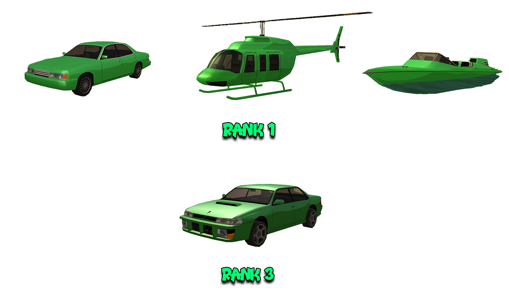

# School Instructor Rules

Besides these rules, all members are obligated to respect both the [Server Rules](../..) as well as [Peaceful Faction and Mixt Rules](../peaceful-and-mixt-faction-rules.md).

## 1. Faction Commands

- [/f] - to discuss with faction members.
- [/sx] - to discuss on the common chat of School Instructors factions.
- [/duty] - to go on duty.
- [/accept < needlicense > < ID >] - to accept a call. You will see a red checkpoint on the map, indicating the player who needs licenses.
- [/cancel < needlicense > < ID >] - to cancel a call from a client who needs licenses.
- [/givelicense < license > < ID >] - give a license to a player.
- [/startlesson < ID > < license >] - start a lesson for the respective license.
- [/stoplesson < ID >] - end the lesson for the license.
- [/requestlicenses < ID >] - request a player's licenses.
- [/clothes] - to change the skin at clothing stores, HQ, or at home.
- [/fvs] - to spawn a faction vehicle.
- [/timestamp] - shows the time in chat. This command must always be active.
- [/fdeposit] - adds a sum of money to the faction's safe.
- [/fputdrugs] - deposit drugs into the faction's safe.
- [/fputmaterials] - deposit materials into the faction's safe.
- [/blacklist [/bl]] - list of players on the faction blacklist.
- [/onduty] - displays a list of all online members, with on-duty members highlighted in green (Rank 3+).
- [/servicecalls] - displays a list of all calls to instructors that can be accepted.
- [/ft] - list of online candidates.
- [/togcomms] - (un)lock the communication channels of the candidate.

## 2. Faction Skins

<figure markdown="span">
    { width="800" }
</figure>

## 3. Faction Vehicles

<figure markdown="span">
    { width=1000" }
</figure>

- 4 Merit - Rank 1.
- 3 Maverick - Rank 1.
- 3 Speeder - Rank 1.
- 2 Sultan - Rank 3.

3.1 The Merit and Sultan can be used when you have to issue licenses with someone or as a means of transportation to another vehicle. You must respawn them and take care of them. Their use for personal purposes is not allowed (sanction: Faction Warn).

3.2 Helicopters and Boats are only used for Flying/Sailing tests. Their use for personal purposes is not allowed (sanction: Faction Warn).

3.3 The use of NOS (nitro) / Hydraulics on faction vehicles is strictly prohibited (sanction: Verbal Warning for the first offense, Faction Warn for the next).

3.4 Painting faction vehicles is only allowed in: Red, Blue, and White (sanction: Faction Warn).

3.5 Members with personal vehicles are asked to drive, and even try to sell licenses with their personal vehicles, as the faction does not have too many vehicles for all members.

3.6 Before using [/fvr], each member must announce on [/sx] at least 10 seconds in advance (punishment: Fine $50,000 + Verbal Warning or Faction Warn depending on number of offenses).

## 4. Licenses

4.1 You are not allowed to issue licenses without the appropriate tests (except for players above level 50+) (sanction: Faction Warn for the first offense, dismissal for the next).

4.2 You are not allowed to grant licenses if either you or the client have any level of Wanted (sanction: Verbal Warning for the first offense, Faction Warn if it continues).

4.3 The [/startlesson] command allows the player to drive a vehicle without holding a license, and this command is to be used before the start of the license test (misusing the command leads to dismissal).

4.4 It is strictly forbidden to offer licenses to anyone without completing the tests (or to offer licenses with incorrectly given tests) or without payment, or for a higher or lower amount, regardless of offers or persons (sanction: Faction Warn for the first offense, dismissal for the next).

4.4.1 If you have taken a client and they do not have enough money to pay for the license, you are not allowed to give them money. Take them to the ATM, and if they don't have money, you can leave. You are also not allowed to refund the money to clients after the test is completed (sanction: Faction Warn).

4.5 It is strictly forbidden to use [/q] after starting a lesson with the client. First, finish the lesson with them, and then if you cannot continue, hand the client over to another colleague (sanction: Verbal Warning for the first offense, Faction Warn for the next).

4.6 You are not allowed to use the command [/repair] during tests, especially during Flying and Sailing license tests (sanction: Faction Warn).

4.7 You are not allowed to administer two or more tests at the same time (sanction: Faction Warn for the first offense, dismissal for the next).

4.8 If you are on duty [/duty] and there are available commands [/servicecalls] or [/needlicenses], you are OBLIGATED to accept them if you don't have a client (sanction: Verbal Warning for the first offense, Faction Warn for the next).

4.9 Rank 2+ members who are on duty are obligated not to refuse clients requesting licenses (sanction: Faction Warn).

!!! danger "Important"
    You will be sanctioned if you intentionally leave the server when a player requests licenses and you are on duty. 
    You have the right to refuse the client if you are not [/duty].

4.10 You are obligated to provide evidence for all tests for the licenses you issue. Failure to provide evidence upon request by the leader or admins will be sanctioned (sanction: Faction Warn for the first offense, dismissal for the next).

For your evidence to be considered valid, it must contain the following:

- a screenshot of [/requestlicense] when the license dialog appears.
- a screenshot when you announce in the faction chat that you will be offering a license.
- screenshots of the test being administered.
- a screenshot showing whether the player passed or failed the tests.

It is recommended to have as many screenshots as possible to demonstrate that you administered the tests correctly.

4.11 When a member takes a client who has not issued [/needlicense], the member must ask on [/sx] if the player has been accepted by someone else. If no one responds within 5 seconds, take a screenshot and continue giving tests to that client (sanction: Faction Warn).

!!! example "Info note"
    Example: "Has anyone accepted Nume (ID)?" 
    This rule will reduce the issue of client theft and spam reduction on [/sx].

4.12 Only those of rank 2+ can grant licenses to those of level 50+ (sanction: Faction Warn).

4.13 You are not allowed to grant licenses on more than 2 accounts of a player (sanction: Faction Warn for the first offense, dismissal for the next).

4.14 It is strictly forbidden to offer licenses to your secondary accounts. If you need licenses on these accounts, contact a colleague (sanction: dismissal).

## 5. Clients

5.1 Rank 1-4 members when taking a client for licenses are obligated to announce on the faction chat in the following manner:

- Nume (ID) with me for x licenses / all licenses (where x is the name of the license).

!!! example "Exemples"
    Xulescu (367) with me for all licenses. 
    Yulescu (102) with me for Flying, Sailing, Weapon Licenses.

    Anyone who does not comply with this rule will be sanctioned (sanction: Faction Warn).

5.2 With players Level 50+, proceed as follows: request [/requestlicenses], ask them which licenses they want and announce that it's with you for those licenses, then give them [/givelicense] (sanction: Verbal Warning for the first offense, Faction Warn for the next).

!!! example "Exemples"
    Xulescu (257) with me for all licenses, Level 50+.  
    Yulescu (341) with me for Flying, Sailing, Weapon Licenses, Level 50+.

5.3 Announce the licenses with their full and correct names: Fishing, Sailing, Flying, Weapon, Materials Licenses. DO NOT abbreviate, DO NOT announce them in Romanian (sanction: Faction Warn).

5.4 Do not stress the clients. If they make mistakes, explain where they went wrong. Do not get angry with them (sanction: Faction Warn).

5.5 If the instructor or the client receives a crash during the license test, they must refund the money for the lesson [/startlesson] (sanction: Faction Warn).

5.6 If the client fails the test, you must explain where they went wrong. You can advise them to check the forum topic [Testul Fiecarei Licente](https://forum.b-zone.ro/topic/246142--) to be better prepared in the future.

5.7 If the client is AFK, wait for them for 5 minutes and gather evidence in the meantime, and if they do not return in the game, you can fail the license tests / cancel the command (sanction: Faction Warn).

!!! example "Exemple"
    Xulescu (ID) failed the test for Weapon License (AFK).

5.8 It is forbidden to steal clients. If you find a player on the street/CNN/etc., ask on [/sx] if anyone has accepted them (sanction: Faction Warn).

5.9 You are not allowed to talk on the phone during license tests. You can communicate through messages (sanction: Verbal Warning for the first offense, Faction Warn for the next).

5.10 You are not allowed to use [/cancel needlicense] without having a valid reason that requires evidence (sanction: Faction Warn).

## 6. Faction Chat

6.1 You are not allowed to spam or use Caps-Lock (sanction: fine of $30,000, Faction Warn depending on severity).

6.2 You are not allowed to use [/TOG] in faction chat. Exception being Rank 4+ members conducting entrance tests with candidates or with approval from Rank 6+ members (sanction: Faction Warn).

## 7. Shared Chat [/sx]

7.1 Vulgar language on [/sx] is sanctioned with dismissal.

7.2 Arguing on [/sx] is sanctioned with Faction Warn or dismissal depending on the case.

7.3 You are allowed to use the [/sx] chat in an open manner, namely free-chat only between 20:00 - 08:00 (failure to comply with the interval: Verbal Warning first offense, Faction Warn second offense).

7.4 You are not allowed to SPAM or use CAPS. Violators of this rule will receive a fine of $30,000.

7.5 Rank 0 members are prohibited from using the common chat [/sx]. Violators of this rule will be sanctioned with test failures!

## 8. Meetings

8.1 During the meeting, only the leader/subleader speaks. If you have a question/comment on the topic being discussed at that moment, raise your hand (/wave). All other questions should be addressed at the end of the meeting (sanction: fine 25,000$ for the first offense, Faction Warn for the next).

8.2 Do not stay AFK during the meeting (more than 3 minutes) (sanction: Faction Warn).

8.3 If you cannot attend the meeting, submit an absence request on the RPG website, otherwise you will be sanctioned (sanction: Faction Warn).

8.4 All members are entitled to a maximum of 2 absences from meetings/activities per month.

8.5 Admins are automatically excused from any meeting/activity within the faction.

8.6 Optional activities must be announced 48 hours in advance before being organized.

8.7 Activities will be organized according to the availability of the organizers, but at reasonable hours.

8.8 Delays to mandatory meetings/activities will be sanctioned as follows:

- being late of up to 10 minutes: nothing.
- being late between 10 and 20 minutes: Verbal Warning.
- being late between 20 and 30 minutes: Verbal Warning + Fine $50,000.
- being late of over 30 minutes: Faction Warn.

## 9. Candidates (rank 0)

9.1 Candidates are not allowed to use faction vehicles.

9.2 Candidates are not allowed to use the shared chat of instructors [/sx].

9.3 Candidates are not allowed to sell licenses.

9.4 Candidates are not allowed to accept a player's [/needlicense] (command).

9.5 Candidates are obliged to obey those of a higher rank and to avoid any disputes with faction members.

9.6 Any player accepted to take the tests must behave decently. If they insult or behave inappropriately towards a faction member, they will be automatically rejected without the right to take the faction entry tests.

!!! danger "Important"
    Candidates who do not respect these rules will be sanctioned by failing the tests.
