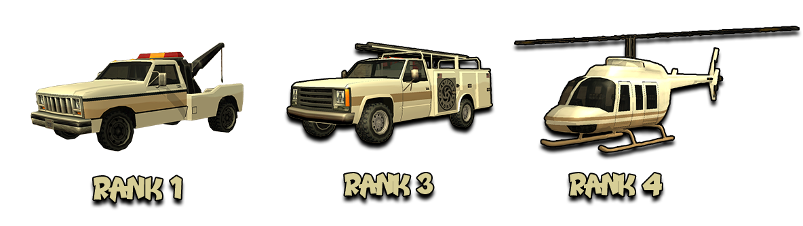

# Tow Truck Company Rules

Besides these rules, all members are obligated to respect both the [Server Rules](../..) as well as [Peaceful Faction and Mixt Rules](../peaceful-and-mixt-faction-rules.md).

## 1. Faction Commands

- [/f] - to be able to discuss with faction members.
- [/accept < mechanic > < ID >] - to accept a call. You will see a red checkpoint on the map, where the player in need of a mechanic is located.
- [/duty] - to be able to use faction vehicles.
- [/tow] - tow a vehicle.
- [/towpoints] - check how many towing points you have available.
- [/clothes] - to change your skin at clothing stores, HQ, or at home.
- [/fvs] - to spawn a faction vehicle.
- [/timestamp] - shows the time in chat. This command must always be active.
- [/fdeposit] - add a sum of money to the faction safe.
- [/fputdrugs] - deposit drugs into the faction safe.
- [/fputmaterials] - deposit materials into the faction safe.
- [/blacklist [/bl]] - list of players on the faction blacklist.
- [/onduty] - displays a list of all online members, with on-duty members highlighted in green (Rank 3+).
- [/servicecalls] - displays a list of all mechanic service calls that can be accepted.

## 2. Towing Vehicles

2.1 To tow a car, use the CTRL button (or left click), and after the vehicle is hooked, use the command [/tow LS / LV / SF], depending on the city you are in.

2.2 Tow Truck Company members can collect up to 120 Tow points. Upon joining the faction, new members will receive 15 Tow points. Every payday, members will receive from 9 to 15 Tow points, depending on rank. To see the number of available tows, use the command [/towpoints].

!!! example "Info note"
    If you don't tow for an hour, the number of untowed cars will be added to the next hour's count.

2.3 When you want to start your activity, you must announce on the faction chat [/f] that you are taking the Tow Truck, to avoid confusion regarding missing cars (sanction: Fine).

2.4 After finishing your activity with the respective Tow Truck, you must respawn the Tow Truck and announce on the faction chat [/f] that it has been respawned (example: "I respawned tow truck / tt rr" ...etc) (sanction: Fine).

2.5 Tow Trucks are strictly used for towing, not for personal use (sanction: Verbal Warning for the first offense, Faction Warn for the next).

!!! example "Info note"
    For personal needs, you can use Utility (minimum rank 3) or personal vehicles.

2.6 The Maverick is only used by rank 4+ for filming / activities. When a rank 4+ member asks on [/f] who is using the Maverick and it's with you, please notify them privately! ATTENTION! Rank 4+ members are not required to announce when they take the Maverick from HQ!

2.7 The areas from which you can tow are quite varied, from simple areas where you need to respect the minimum required rules (e.g., towing a car in a neutral zone, on the road), to areas with special regulations (e.g., Safe Zones, certain road sections or Spawns). For these, multiple pictures will be explicitly displayed, to know if towing those vehicles is correct or not. These areas are presented in the special topic [Legal / Illegal Towing](https://forum.b-zone.ro/topic/386771--).

2.8 Faction and secondary job vehicles, planes, and helicopters require /dl under 1000HP to be towed and entered into the checkpoint. These vehicles have special regulations and can be towed from any location, excluding HQs or specially designated areas.

2.9 Civilian planes and helicopters can be towed from any location, except airports or specially designated areas for these types of vehicles.

2.10 Large vehicles (buses, trucks, planes, etc.) cannot be towed normally, you will need to grab them from the middle for them to fit into the hook.

2.11 You cannot tow two-wheel vehicles (bicycles, motorcycles, etc.) or boats. You can only tow four-wheel vehicles.

2.12 If you tow a personal vehicle and notice that it is parked in the same location considered unauthorized, it means it has [/park] there and must be towed to a nearby location that does not obstruct traffic. If you tow a car with [/park] 3 times, 15 minutes each time, it is considered report fraud (sanction: dismissal).

2.13 You are not allowed to tow a vehicle when a player is inside, whether they are AFK or not (sanction: Faction Warn).

2.14 If someone calls after you to leave their car, you are obliged to do so (sanction: Faction Warn).

2.15 To see the number of tows made, access the RPG website in the section [My Account -> Faction Reports](https://www.rpg.b-zone.ro/account/factionReports) or you can use the in-game command [/raport].

2.16 The amount of money you receive does not vary depending on the vehicle, but rather on the rank held.

2.17 You are obligated when towing a vehicle to have evidence with [/dl] turned on that you have correctly towed it, evidence that may be requested by a rank 6 (sanction: Faction Warn).

!!! danger "Important"
    If you are reported for illegal towing and you don't have evidence, you will be sanctioned for illegal towing (sanction: dismissal).

## 3. Faction Skins

<figure markdown="span">
    { width="800" }
</figure>

3.1 You are allowed to wear skins of lower ranks than yours (e.g., if you are rank 5, you can wear skins from ranks 1-4).

3.2 Skins purchased from Platinum, Diamond, or Onyx type Clothing businesses can be worn.

3.3 Wearing a skin of a higher rank is not allowed (sanction: Faction Warn).

!!! example "Info note"
    With the Leader's permission, other skins can be worn besides the rules mentioned above.

## 4. Faction Vehicles

<figure markdown="span">
    { width=1000" }
</figure>

- 40 Tow Truck - Rank 1.
- 5 Utility Van - Rank 3.
- 1 Maverick - Rank 4.

4.1 Before performing [/fvr], a rank 5+ member is required to announce and wait for a minimum of 5 seconds before typing the command; otherwise, they are sanctioned with a Fine for the first offense, and with a Verbal Warning for the second offense, and ultimately with a Faction Warn.

4.2 If a rank 5+ member announces [/fvr], another rank 5+ member is not allowed to intervene by issuing [/fvr] unless with the agreement of the first announcer! (sanction: fine).

4.3 If a member parks their car in the area at the entrance to HQ, spawn cabin, or courtyard access gate, they will be sanctioned with a Verbal Warning.

4.4 You are not allowed to spam with [/fvr] and [/fvs] (sanction: Faction Warn for the first offense, dismissal for the next).

4.5 Tow Truck Company members are allowed to add tuning elements to faction vehicles (noss, hydra, etc.).

## 5. Others

5.1 Members of ranks 1-5 are not allowed to hold the Detective job while in Tow Truck! The Detective job can only be held in Utility, Maverick, or personal / server-spawned vehicles! (sanction: Faction Warn).

5.2 It is permitted to possess / use drugs at any time. If you are caught with drugs, you will be sanctioned by the police.

5.3 The command [/ftalkpower] can be used by any rank 5+ member. If someone is caught abusing this command, they are sanctioned with a Faction Warn.

5.4 It is forbidden for a member to be AFK in the spawn cabin or faction vehicles! Any member caught AFK in the spawn cabin or faction vehicles is sanctioned. 0-2 minutes -> Fine, 2-5 minutes -> Verbal Warning and over 5 minutes Faction Warn.

5.5 As a Tow Truck Company member, you are allowed to carry any weapons for self-defense. If you kill a player without clear evidence that they attacked you, you will be sanctioned with a Faction Warn.

5.6 Admins will be exempt from mandatory activities because they have important responsibilities to take care of (cheaters, handling reports, etc.).

5.7 Helpers will not be exempt from mandatory activities; they will have the same number of exemptions as any other member. We consider it sufficient that they benefit from a halved report.

5.8 During meetings / mandatory activities, members are strictly forbidden from being AFK (idle or [/sleep]) without the organizer's consent. Anyone caught AFK without consent will be sanctioned as follows: 0-2 minutes Verbal Warning, over 3 minutes Faction Warn.

5.9 Offering [/refill], [/repair], and [/refillgascan] is the secondary activity performed by all faction members. These services are also part of the weekly report. Offering these services is done respecting the following prices:

- [/refill] - 50$
- [/repair] - 50$ 
- [/refillgascan] - 20$

5.9.1 Faction colleagues / members from partner factions are offered [/repair], [/refill], and [/refillgascan] for a maximum amount of 1$.

!!! danger "Important"
    Anyone offering more than the specified amounts above will be sanctioned as follows: first offense Verbal Warning, and next offense Faction Warn.

5.10 Spamming (at least 6 messages) on the faction chat will be sanctioned as follows: fine for the first offense, Verbal Warning for the next.

5.11 Rank-up requests are allowed, but not in an abusive manner by spamming the leader. Those who violate this rule may receive a Faction Warn.

5.12 Members with ranks between 4 and 6 (inclusive) are strictly prohibited from changing the candidate's status to rejected/accepted without the leader's consent.

5.13 Higher ranks must always be respected. As long as the leader or sub-leaders are not online, you must respect the highest online rank. If you do not obey the higher online rank, you will be sanctioned with a Faction Warn.

5.14 Mandatory activities can be organized by the Leader with a well-founded reason and the approval of a Senior Admin. Considering that these will be quite rare, all members must attend and are not entitled to exemption, except for players who have requested inactivity for that particular week. A mandatory activity is valid if it is announced at least one week (7 days) in advance (sanction: Faction Warn).
