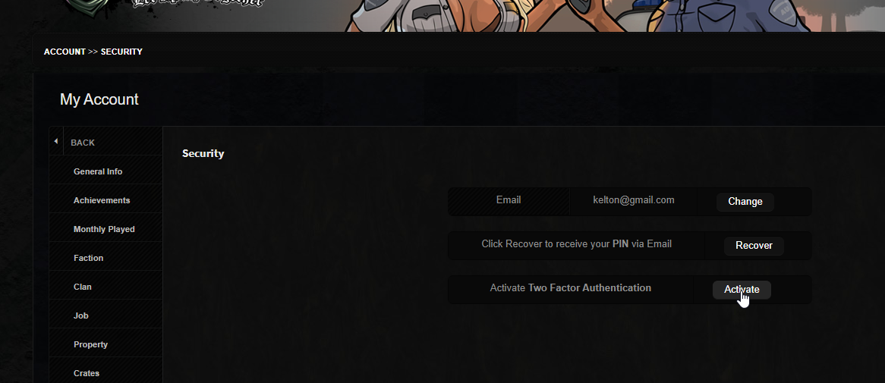
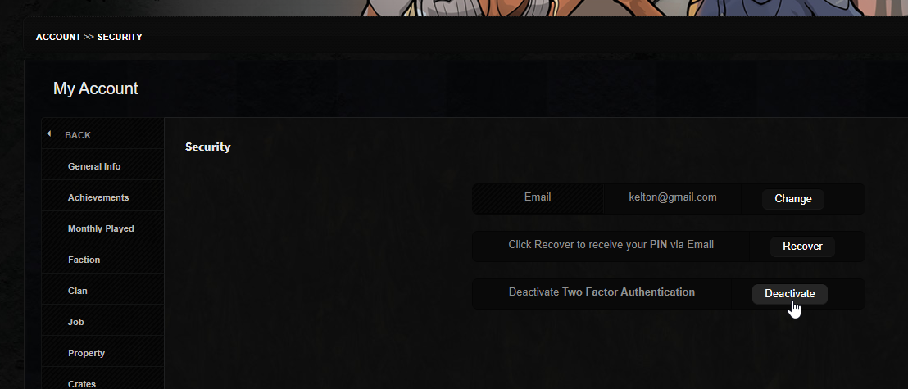
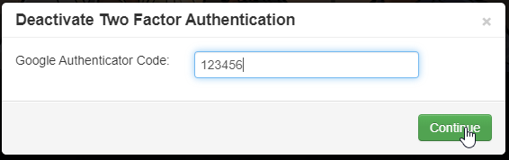

# B-Zone SA:MP Rules

## 1. Accounts

The owner of an account is always considered to be the possessor of the email address registered on the account. For security reasons make sure you do not lose access to the account's email address, otherwise it is lost.

The staff offers limited help via [the recovery system](https://www.rpg.b-zone.ro/account/recoverAccount) on the RPG website and does not guarantee the recovery of a lost account. We reserve our right to reject recoveries  without offering any reason.

!!! example "Info note"
    All punishments will be given depending on the real level of the player (meaning we will calculate the respect points of the player to determinate their real level).

### Accounts/Goods Businesses
We do not allow businesses or attempts of businesses with real goods for game goods (punishment: permanent ban).

We do not allow businesses or attempts of businesses with gold for game goods (punishment: ban 30 days).

We do not allow businesses or attempts of businesses that involve creating multiple clans and selling them overpriced after they get older than a month (punishment: ban 30 days).

We do not allow businesses or attempts of businesses with accounts for real or game goods (punishment: permanent ban without the right to buy shop unban).

!!! danger "Important"

    The second offence is punished directly with permanent ban without the right to buy shop unban.

    Due to the multitude of players who violate these rules, we reserve the right to hold accountable and sanction transfers or businesses that have no logical reasoning or justification.

### Account Security
The staff does not handle problems regarding hacked accounts, stolen goods, punishments received while your account was hacked and so on. It is your duty to take care of your account or your email address.
Sharing an account with other people may lead to such probems and you risk remaining without an account, goods or get punished because of this.

Recovering a lost account can only be done by [a recovery request](https://www.rpg.b-zone.ro/account/recoverAccount) on the website, by clicking the Sign In button and then on Lost your account. Read the rules that show up carefully when trying to recover an account.

!!! example "Info note"

    Level 4+ admins reserve their right to punish someone who hacks accounts or to help someone with a hacked account if they consider necessary. 

    Attention, admins have absolutely no obligation to punish someone or help you if your account got hacked.

??? warning "Examples of ways your account can get hacked"

    - sharing your password/PIN with others.
    - using easily guessable password and PIN.
    - not activating 2FA (two-factor authentication) on your account.
    - having your email address compromised.
    - entering your password and PIN in places other than our SA-MP server or our server's website.
    - clicking on unknown links.
    - downloading unknown files.

??? success "Preventing account hacking"
    - the most important prevention method by far is activating 2FA, details on how to do this can be found below.
    - do not share your account password/PIN with anyone under any circumstances.
    - use a password that is at least 10 characters long, contains at least 1 uppercase letter that is not the first letter, at least 1 digit, and at least 1 symbol (ex: andr3!Pl4yB!g).
    - secure your email address using the same tips as securing your sa-mp account, and activate 2FA there as well.
    - do not use or enter your password and PIN on servers or websites that do not belong to us. We will never organize giveaways where you need to enter your account password. Those are 100% scams. These websites are known as phishing sites. Find more information online.
    - do not click on links that you do not recognize as completely safe. Clicking on some links may take you to websites that contain cookie stealers (which connect someone else to your accounts stored in your browser) or automatically install various viruses.
    - do not download or accept files that you do not fully trust as being clean. You could receive a file from a friend that contains viruses. You could download a mod or modpack that contains viruses. Not everything you find on the internet or receive from others is clean. If you need mods, we advise you to download them only from our forum from [the mods section](https://forum.b-zone.ro/files/), where they are verified before being approved there.

    #### 2FA Activation Tutorial

    In short, 2FA is an additional application on your phone that generates a 6-digit code that changes periodically. That code will be used to log in to your account when the calendar day changes or when your IP changes.

    Important to know: if you do not have 2FA activated and someone logs into your account, that person can activate 2FA and lock you out of your account. Another thing you need to know is that if your email address is compromised, the person who compromised it can use it to gain access to 2FA on the sa-mp server, so be careful with your email and set a valid email on your account.

    For enhanced protection, 2FA is mandatory for individuals holding positions on the server (leader, helper, admin) and they will not be able to use their accounts without having it activated.

    If you deactivate 2FA after activating it, the old entry in the app will no longer work. You must use the entry from the app created at the time of 2FA reactivation.

    In case of loss or reset of your phone, or deletion of the app, the secret key with which you can regain access to 2FA can be recovered using our [2FA recovery system](https://www.rpg.b-zone.ro/account/recoverTOTP) on our website.

    1. Activating 2FA is done on the RPG website, by going to My Account and then to Security. Click on the activation button.
    <figure markdown="span">
        { width="800" }
        <figcaption>2FA Activation</figcaption>
    </figure>

    2. A window will open with a QR code and a secret key. Read the instructions carefully and download the desired 2FA application. Do not close the window! 
    You can use Google Authenticator, Authy, or another preferred application. 
    Tip: Save that long code (the secret key) somewhere in case you lose access to your account's email.
    <figure markdown="span">
        { width="500" }
        <figcaption>2FA Activation Window</figcaption>
    </figure>

    3. After installing the desired application, look for the add button and select the desired option: scan the QR code or manually enter the secret key (that long code).
    <figure markdown="span">
        { width="250" }
        <figcaption>Adding a New Entry</figcaption>
    </figure>

    4. If you opted for the QR code scanning method, then all you have to do is point your phone's camera at the QR code on the RPG website. The phone will automatically recognize the QR code and add a new entry to the application.
    <figure markdown="span">
        { width="250" }
        <figcaption>Scanning the QR Code</figcaption>
    </figure>

    5. If you opted for manual entry, enter the desired name for the entry, copy the secret key (that long code) into the application exactly as it is, including uppercase letters, lowercase letters, and numbers. Also, leave the "Time Based" option checked because the codes only work based on that.
    <figure markdown="span">
        { width="250" }
        <figcaption>Manual Entry</figcaption>
    </figure>

    6. The final step is to add the code generated by the new entry in the application to the window on the RPG website. Enter the code there, without spaces, and click the Activate button to activate your 2FA.
    <figure markdown="span">
        { width="500" }
        <figcaption>Final Activation</figcaption>
    </figure>

    7. Deactivating 2FA is also done from My Account, going to Security and clicking on the deactivation button. 
    You will not be able to deactivate 2FA without access to the code generated by the application with which 2FA was initially activated.
    <figure markdown="span">
        { width="800" }
        <figcaption>2FA Deactivation</figcaption>
    </figure>

    8. In the window that opens, you will need to enter the code generated by the application and click the green button. You will then receive a success message and see that 2FA is deactivated.
    <figure markdown="span">
        { width="500" }
        <figcaption>Final Deactivation</figcaption>
    </figure>

    At this point, 2FA on your account is completely deactivated, so the risk of compromise is higher. Remember that it is your responsibility to ensure the correct security of your account.

### Multiple Accounts
You can own multiple accounts, but breaking some rules like: illegal businesses, stealing accounts, cheating, forbidden mods, bug abuse, advertising, scamming, language, toxicity, repeated rule breaking, other severe rule breaking can be punished on all accounts you own.

### Account Sharing
Sharing an account with another person is allowed but will be done on your own accord.

!!! danger "Important"

    For bans of at least 14 days we will punish secondary accounts with a higher level than the banned account when one of these conditions are met:

    - when they share in at least 3 different days common IPs for the last week since the punishment was given.
    - have the same email address and the account has been recently active in-game (past month).
    - at the moment of the punishment share the same IP.

    In certain situations the staff can ban secondary accounts that do not apply in this rule with the approval of a level 6 admin.

It is strictly forbidden for members of the RPG team (leaders, helpers, admins) to share their accounts with other people without informing and discussing with the Supervisor or Manager beforehand. The consequence for breaking this rule is removing you from your position or even banning your account if needed.

### Server Activity
Any method of accumulating hours played, leaving the AFK state, automizing actions for you, etc. (autoclickers, blocking keys, route recording mods or other mods, riding accounts in/on cars, abusing the poker system, etc.). This also means controlling secondary accounts in any way, usually by using mods.

Admins will interract with you directly or indirectly, where it is necessary, in order to ensure that you are actually moving the character in game, and if they determine you broke the rule you will get punished with ban 1 day, or more with the approval of a higher level admin for multiple offenses, as well as deleting certain prizes you might have received.

!!! danger "Important"
    In case of advanced mods (that answer automatically, that send warnings when an admin checks, that auto moves the character, that automates actions in your place, etc.) will receive a higher punishment because the verification process is more complicated. The punishment will be etablished by the admins, depending on the case.

We will no longer accept mocking responses to admins who try to determine if you are active on the account. Our purpose is to make sure that you play fair and respect the systems we offer, so don't complicate things.

We also offer players to check and report other players if they catch them using such methods.

As long as you play normally, you move the account, one at a time and don't use methods to explicitly grow your activity abusively, you shouldn't have any fear and the rules above don't apply to you. They are intended for players that try to explicitly abuse, not players who play normally.

### Inactivity
Players that do not have at least 20 REAL hours played in the last 2 months risk losing their house or shares to all owned businesses (no vehicles).

Players with houses bought from the shop need at least 10 REAL hours in the last 2 months not to lose them.

If you cannot play we suggest selling your properties so you don't lose them. You cannot recover properties lost due to inactivity.
Attempts of trying to hide properties from inactive accounts will not stop you from losing them.

!!! example "Info note"
    The last 2 months of gameplay are always considered the last 2 months before the current month.
    
    So if it is currently April, we will consider the last 2 months of gameplay to be: March + February.

    If we move to May, the last 2 months of gameplay will be: April + March. If we move to June, the last 2 months of gameplay will be: May + April, and so on.

## 2. SA:MP Client, Cheats, Mods, Bugs and Advertising

### The SA:MP Client
We recommend using the official SA:MP client for desktop available for download on [b-zone.ro/samp.](https://b-zone.ro/samp)

Using third party unofficial clients is allowed on your own accord, but we are not responsible for the possible punishments you may receive because of certain bugs/options these may have.

!!! example "Info note"
    The Android client has such bugs/options. As long as you don't use them you can also play using it.

### Cheats
Using cheats or connecting with them on our servers is strictly forbidden (punishment: ban 30 days).

The second offence will be punished with permanent ban.

Accounts up to level 5 included will directly receive permanent ban. We will give ban IP on accounts banned for trollhack and to players that create multiple accounts for cheating or ruining the game of others.

Cheat examples:

- cheats that modify the way a player shoots with a weapon, aims, does damage to others, loads the weapon faster etc. (aimbot, norecoil/nospread, rapidfire, damage hack and others).
- cheats that allow seeing players or their names for a larger distance than normal or through objects (wallhack and others).
- cheats that modify the maximum speed of vehicles, the acceleration, dimension, resistence, color, components (tuning), integrity (repair) etc. (speed hack, acceleration hack, drift mods, repair mods, tuning mods, airbrake and others).- cheats that allow players to teleport, run faster, jump higher, fly, climb on buildings, to use certain animations that are not in our server's script etc. (teleport hack, prototype, parkour, flying cheats, jump cheats and others).
- cheats that allow you to modify your life, armour, give yourself weapons etc. (health hack, armour hack and others).
- cheats that allow you to find certain hidden objects during special events.
- other cheats that give you abilities that are not integrated in the script or game.

### Mods
Using mods that bring you an unfair advantage towards the rest of the players or connecting with them on our servers is forbidden (punishment: ban 3 days).

If you ar not entirely sure a mod is allowed it is indicated to not use it.

Examples of allowed mods:

- mods that modify your crosshair only for visual aspects.
- mods that modify skins only for visual aspects (without changing the size/hitbox of the skin).
- mods that modify vehicle skins only for visual aspects as long as they have the same dimensions and passenger slots as default.
- mods that correct the sensitivity in game of the mouse.
- mods that modify the colors of the game and make it seem more real (ENB, timecyc, others).
- mods that modify the sky, trees, buildings and other aspects of the game as long as they don't become transparent, you can't pass through them.
- mods that modify weather or time in game for visual aspects (always night/day and others).
- mods that modify animations as long as those animations aren't faster than the original (run faster, roll faster, jump higher and others).
- mods that modify the HUD for visual aspects.
- mods that allow you to connect on multiple servers in the same time.
​- drift mods (as long as they are not used abusively in situations like cop chases or others)
- the CLEO library and Sampfuncs extension.
- fake escape.
- infinite run/stamina.
- other mods that bring modifications only for visual aspects that you see and cannot be use abusively as regards to our script.
 
Examples of unallowed mods:

- mods that modify the sensitivity in such a way that the player fires as like using cheats.
- mods which can be cataloged as cheats.
- mods used for abusive purposes and against the server's script and original settings of the game.
​- no fall mods.
- modes that allow increasing the zoom to hit players more easily (especially with a sniper, but also other weapons)

### Bug Abuse
Exploiting certain mistakes/errors of the game or server is forbidden (punishment: warn).

Severe abuses like bugs for making money, stealing goods and so on will be punished with ban 30 days.

Abuse examples punishable with warn from the first offence:

- fast c-bug or other abusive animation cancellations; informative clip: [click](https://www.youtube.com/watch?v=2bUNdER47dA).
- using certain animations that allow you not to lose HP when falling off a building.
- using certain texture bugs when you have wanted (or not) and hiding from the police or hitmen.
- bugs that allow you to get unfreeze/untie.
- bugs that allow you to kill other players.
​- bugging war vehicles in textures.

Other minor abuses not found in the list above will be punished with kick at the first offence, then warn.

### Advertising
Intentional advertisement made to other servers that do not belong to the B-Zone community is forbidden (punishment: ban 14 days).

The second offence will be punished with permanent ban.

Accounts up to level 5 included will directly get permanent ban.

## 3. Scamming
All server deals will be made using the /trade command. Deals made without using this command may lead to scams and you risk remaining without your goods.

!!! example "Info note"
    Admins will not intervene in scams that players do only in certain circumstances established by them. Thus level 4+ admins reserver their right to intervene in certain scams and even punish the player doing the scam if needed. 
    
    Attention, admins have no oblgation to punish someone or to help you if you got scammed.

## 4. Language
We allow our players to express themselves freely, but without using vulgar or hard language towards other players, on global chats or faction chats.

Examples of punishable language:

- suck my dick, fmm, cocksucker, fuck you etc.
- different inventions to modify cursing like: di_ck, fememe, fuc y0u etc.
- censored insults or censored vulgar language used in an exagerated manner.

Examples of unpunishable language (exception towards admins):

- asshole, loser, jackass, idiot, or other forms of light offences.
- language that is sufficiently well censored: suck \*\*\*\*, eat \*\*\*\*, *** etc. (censored language will also be punished if the censorship is insufficient and the context can be well understood)
- obscene signs (\_|\_, \_\(\)\_ etc.).

Language on clan chats will be punished by clan owners, except when the language is done by the owner himself, is addressed to admins or faction colleagues.

To ensure a pleasant and easy to administrate game, the only allowed languages on public chats are Romanian and English. Using any other language on public chats (/ad, /gov, /live, /news, /f, /r, /d, /sx, /tx) is forbidden (punishment: warn). On private chats (local, /sms, /call, /whisper, /carwhisper, /c, /ac) you are allowed to use other languages.

### Civilians
- level 1-5: kick at first, 30 Minutes Mute afterwards.
- level 6-9: 120 Minutes Mute.
- level 10+: 1 day Ban.

The punishment will grow with 2 extra days at each other offence.

### Faction members
Will get punished in accordance with the faction rules.

### Offences, insults or vulgar language to admins or the server
- offences: 120 Minutes Mute.
- vulgar language or heavy insults: ban 3 days.

The punishment will grow with 3 extra days for each extra offence.

The punishment will only be given for language used in game or on the website.

Admins can ask a Level 6 Admin permission to offer bigger punishments than these if necessary.

### Property Name
Players that use offensive, vulgar or deceiving texts on owned properties (cars, businesses, houses) will be punished with warn. 

In the case of vehicles, players on board who do not own them may also risk being sanctioned, depending on the situation. If they refuse to change the text they will get banned 3 days until they do so.

### Spamming
It is forbidden to repeat the same message 6 times or fill the chat for no reason (punishment: mute 15 minutes).

We are excluding from this rule spam on /sms, which can be taken care of using /ignore. Even so, the use of mods that send massive spam via sms or other methods will be punished with ban for illegal mods.

## 5. NON-RP Behavior
By non-rp behavior we understand an action or abuse of certain commands that ofer the given player an unfair advantage or other players a significant disadvantage in some situations.

- level 6-9: 30 Minutes Ajail.
- level 10+: 60 Minutes Ajail.

Examples of non-rp behavior:

- throwing yourself intentionally in front of passing vehicles to give the drivers wanted.
- pushing job vehicles, faction vehicles or personal vehicles in an abusive way (for example to respawn them, move them from the owner/driver etc.).
- intentional drive-by with Monster Truck, Sandking or vehicles with no collison (those from jobs).
- staying AFK with wanted in air.
- /sleep when you are followed by a police officer/hitman.
- blocking access points using parked vehicles.
- diverse abusive actions of disconnecting or respawning in order to escape the punishments you need to receive from police officers.
- attacking other players, as a clan member, inside or near clan zones without being directly involved in the conquest/defense of that area; if members of other clans have already initiated a battle for that area, it is prohibited for other individuals who are not part of those clans to intervene (punishment: kick for the first offense, ajail for subsequent offenses).

## 6. Global Chats
Global chats are those chats that can be seen by all the players of the server (/ad, /live, /e, /news, /gov etc.).

Offenses on such chats are forbidden (punishment: warn) as well as heavy insults/vulgar language (punishment: ban 3 days).

The punishment will grow with 3 extra days for each extra offence.

It is not allowed to promote social media channels (youtube, tiktok, facebook, etc) on such chats (punishment: kick), except for channels belonging to the game staff or community YouTubers (ex: [b-zone.ro/bobo](https://b-zone.ro/bobo)).

### Live or Event chat
It is forbidden to make bad jokes, mock, spam, use emoticons, use obscene signs (punishment: kick/stopevent).

Admins can ask a Level 6 Admin permission to offer bigger punishments than these if necessary.

### Public announcements
Not allowed (punishment: kick):

- announcements in the name of others without their approval.
- organizing events.
- using emoticons, abbreviations or excess of punctuation signs.
- excessive caps lock.
- mock ads.
- to contact one ore more players.
- to promote channels with videos that do not belong to the community (be advised of advertising).
- to search for friends.
- obscene signs (\_|\_, \_\(\)\_ etc.).
- begging.

The second offence will be punished directly with warn.

## 7. Extra Rules

### Nickname player/clan, clan crests
It is forbidden to use a mocking, indecent, very similar name with other players/admins, with an official clan tag (punishment: rename).

It is forbidden to use an indecent, vulgar, very similar to others, etc. clan name/tag. (punishment: rename of the clan).

If the rename is refused or it is not possible we will give permanent ban.

The use of an indecent, vulgar, or highly similar clan crest to another clan's crest is strictly prohibited (punishment: removal of the crest, imposition of a significant cooldown, and possible sanctions for the owner, where applicable).

### The /report function
It is used to signal rule breaking or for problems in a polite and calm manner. Anything else is forbidden (punishment: mute 30 minutes).

### The /n function
It is used to ask for informative help in a polite and calm manner. Anything else is forbidden (punishment: mute 30 minutes).

Offences, heavy insults or vulgar language on this chat will be punished just like addressing them to admins.

### Unban requests
Any request made in mockery or that contains inappropriate language will be punished and ignored (punishment: ban 14 days).

The second offence will be punished directly with permanent ban.

### Disturbing players or the staff
It is forbidden to disturb players at jobs, at activity report, rob, auto exam, events or admins when they have work to do (punishment: kick).

The second offence will be directy punished with warn.

!!! example "Info note"
    In the case of department members, they can use summons and directly sanction the player with a wanted level depending on the situation (non-compliance, DB, DM, etc.).

### Using cheaters in clan zones
We reserve our right to delete a clan where one or more players have been caught using cheats in order to help conquer clan zones. 

The clan owner is directly responsible with the players he invites in the clan, especially low level accounts who use cheats to conquer clan zones. 

The clan can be permanently deleted without returing the Gold spent on it to the clan owner.

### Abusive clan level increase

We reserve the right to modify the clan's XP or even delete the clan where it is determined that the clan level has been increased abusively.

### Function abuse
Severe function abuse which involves modifying several accounts will be severely punished (punishment: permanent ban without the right to buy shop unban).

### Distribution of personal data
It is forbidden to share personal information of other players without their consent (links with pictures, videos, phone numbers, personal IDs, personal emails, personal addresses, and so on) (punishment: ban for 7 days OR another penalty with the approval of an admin level 6).

### Blackmail
Blackmailing players to withdraw or not to create complaints and paying a player to withdraw or not to create complaints is not allowed (punishment: warn).

!!! example "Nota informativa"
    The sanction for blackmail applies solely based on the evidence from the game.

    We recommend not engaging in discussions outside of the game with players whom you do not know and who are attempting to report you or have already done so.

## 8. Website

### Proofs
Server proofs must include the server markings with the date, hours, name of the player and name of the server, except for rule breaking that consist of bans lasting 14 days or more (complaint automatically rejected).

A proof is valid for 3 days at most and must be owned by the person opening the complaint, exception for admins, cheats, illegal business, forbidden mods or other severe rule breaking (complaint automatically rejected).

Falsifying proofs is strictly forbidden (punishment: ban permanent from first offence, no unban at second offence). We will also ban the higher level accounts of the player.

Evidence should preferably be presented without using page-up, in order to accurately interpret the situation. Depending on the case, these pieces of evidence may be taken into consideration, but there is also a risk of them being ignored if they are unclear.
We accept concrete evidence outside the server, video preferred, for complaints regarding illegal businesses, account hacking, vulgar comments, staff complaints (leader, helper, admin) or other severe rule breaking.​

For browser proofs we accept only videos where there is a minimum of one refresh to the page to prove that there is nothing falsified (complaint automatically rejected).

### Content
It is forbidden to open complaints or tickets for inproper reasons (punishment: suspend website 3 days).

It is forbidden to offend others anywhere on the website (punishment: suspend website 3 days).

It is forbidden to insult, publish vulgar content (messages, pictures, videos), or pornographic content anywhere on the website (punishment: website suspension for 7 days OR another penalty with the approval of an admin level 6).

It is forbidden to post personal information of other players without their consent (pictures of them, phone numbers, personal IDs, personal emails, personal addresses, and so on) (punishment: website suspension for 7 days and deletion/editing of content OR another penalty with the approval of an admin level 6).

It is forbidden to advertise (servers, websites, pages, channels, clips, etc.) (punishment: website suspension for 3 days or ban for 14 days/permanently).

We reserve our right to web suspend players that abuse the ticketing system.

!!! example "Info note"
    The rules above apply also to deleted comments, withdrawn complaints, added witnesses, proofs posted in complaints, external content (links to other sites) and so on.

??? warning "Pointless complaining and posthunting"
    #### Posthunting
    We define a posthunter as a person with ill intent who intentionally seeks even the smallest mistakes or puts another player in very difficult situations in order to report them to the staff, with the ultimate goal of sanctioning them.

    Considering the various situations that may arise through complaints, the server staff is the only authority capable of deciding when a player is attempting posthunting.

    Consequences of posthunting:
    
    - complaints will be ignored and a warning will be issued if there are only a few complaints.
    - if the player exaggerates or has already been warned, the complaints will be ignored and a minimum 3-day web suspension will be issued, with the sanction increasing depending on the number of offenses.
    - complaints from secondary accounts will also be ignored.
    - in the case of posthunting between faction colleagues, the member will be warned to cease the behavior, and the complaints will be ignored, with direct sanctions such as Faction Warn or dismissal depending on the case for subsequent offenses.

    What is not considered posthunting:

    - reporting a player who gravely insults you or speaks vulgarly with evidence.
    - reporting a player suspected of using cheats or illegal mods, with valid evidence and where the admins have not already made a decision.
    - reporting a player who abuses bugs to gain an unfair advantage over you.
    - reporting a player intentionally advertising another server to lure players there.
    - reporting a player who has scammed you.
    - reporting a player engaging in non-roleplay behavior to gain an advantage and abuse you.
    - reporting a player who insults/swears on global chats (live, news, event, gov, ad, etc.).
    - reporting a player who blackmails you.
    - reporting a player who has falsified evidence against you.
    - reporting an admin/leader who has sanctioned/dismissed you wrongly.
    - reporting a leader who has unreasonably rejected you from a faction.
    - reporting an admin/leader who has given a wrong answer to a complaint made by you.
    - other similar situations.

    What is considered posthunting:

    - reporting another player who does something that does not directly affect you and does not constitute a serious rule violation.
    - exaggerated reporting of admins because you disagree with the decisions made even if multiple admins have given the same response.
    - reporting a leader for unreasonably rejecting a player who applied to the faction.
    - reporting a leader for not responding promptly to complaints without you having an active complaint in that faction.
    - reporting a leader for not posting certain sanctions/evidence on the forum without you being part of the faction or being the one sanctioned/tested, etc.
    - reporting a helper for giving a wrong response without you being the one they responded to (except for insulting/vulgar messages).
    - when a player opens multiple complaints where the response is against them (player is unaware of the rules).
    - reporting an admin/leader who has wrongly sanctioned someone else other than you.
    - when it is observed that the player's intention from the beginning was to intentionally seek a rule violation to bring sanctions against the reported person.
    - other similar situations.

### Reporting staff members
Complaints to staff members (leader, helper, admin) can be made just by people involved directly (complaint rejected automatically).

## 9. Exceptions
We reserve our right to have exceptions to these rules. In some cases the punishments may be different.

Players that: have too many punishments, have too many trouble accounts, create accounts just to ruine the game, are considered to interfere too much with the game will get banned permanently.

These exceptions can be made only with the permission of a level 6 admin.

!!! danger "Important"
    Registering an account within the server implies your obligation to adhere to the imposed regulations.

    The rules aim to maintain an enjoyable game for everyone and cannot encompass all situations in which someone might disrupt the game, which is why we reserve the right to make <strong>exceptions.</strong>

    If you have questions about situations not explicitly addressed in the regulations, you can contact us by opening a [ticket](https://www.rpg.b-zone.ro/ticket). Arbitrary interpretation of the regulations to gain unfair advantages is not permitted.
