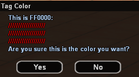
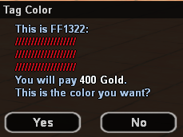

# Culoare Clan

<figure markdown="span">
    { width=400" }
    <figcaption>Schimbare Gratuita</figcaption>
</figure>

<figure markdown="span">
    { width=400" }
    <figcaption>Schimbare Platita</figcaption>
</figure>

## Informatii Generale

!!! warning "Atentie"
    Preturile in gold prezentate in aceasta pagina sunt cele standard. Este posibil ca in joc produsele sa fie mai ieftine daca faceti achizitionarea intr-o perioada de reduceri.

Optiunea de **Clan Color** de pe /shop permite schimbarea culorii specifice clanului.

Culoarea specifica se regaseste in TAG-ul si numele clanului: la numele jucatorului, pe peretele HQ-ului, pe peretele teritoriilor detinute.

Pretul standard pentru schimbarea culorii clanului este de **400 Gold**.

Prima schimbare de culoare a clanurilor este gratuita si se face prin comanda **/clancolor**, unde va trebui sa introduceti un **cod HEX** pentru culoarea dorita. Veti vedea de asemenea un preview al culorii si un mesaj de confirmare inainte sa se schimbe culoarea.

Puteti gasi o gramada de website-uri prin simpla cautare pe Google pentru "hex picker". Daca nu mai doriti sa cautati manual astfel de site-uri puteti intra direct aici: [HTML Color Picker](https://www.w3schools.com/colors/colors_picker.asp)

- Va trebui pe urma sa alegeti culoarea dorita facand click pe ea.
- In partea dreapta veti vedea apoi o previzualizare a culorii selectate, cat si codul HEX. In cazul nostru codul HEX este **3399FF pentru albastru**.
- Acum ca aveti codul HEX puteti folosi in joc comanda **/clancolor 3399FF** ca sa schimbati culoarea.

!!! danger "Atentie"
    Ca sa va functioneze codul HEX in joc trebuie sa-l scrieti intotdeauna cu LITERE MARI.

## Cum cumperi?

Urmeaza pasii urmatori:

1. Achizitionarea de Clan Color se face direct din comanda de **/clancolor**.
2. Utilizati indicatiile de mai sus pentru a selecta culoarea dorita si confirmati schimbarea apasand pe butonul **Yes**.
3. **Felicitari!** Acum ati modificat culoarea clanului.
