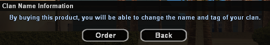
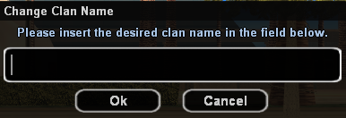

# Clan Name and Tag

<figure markdown="span">
    { width=400" }
    <figcaption>Confirmation dialog</figcaption>
</figure>

<figure markdown="span">
    { width=400" }
    <figcaption>Select new name</figcaption>
</figure>

<figure markdown="span">
    { width=400" }
    <figcaption>Select new TAG</figcaption>
</figure>

## General Information

!!! warning "Warning"
    The gold prices presented on this page are standard. It is possible that in-game products may be cheaper if you make the purchase during a discount period.

The **Clan Name+Tag Change** option from /shop allows changing the name and TAG of the clan.

The standard price for changing the clan name and tag is **600 Gold**.

When changing the clan name and tag, make sure you choose a decent name and tag allowed by the regulations. Clans that put random, vulgar names/tags, etc. will be renamed by staff or even deleted without any prior warning.

The clan name must be between a minimum of 1 and a maximum of 22 characters.

The clan TAG must be between a minimum of 1 and a maximum of 4 characters.

## How to Buy?

Follow these steps:

1. Access the community shop using the **/shop** command.
2. Select from the displayed list an item whose name follows this model: **Clan Name+Tag Change - price Gold**.
3. You will then receive a confirmation dialog that you want to purchase this product.
4. In the next dialog, you will need to enter the new clan name following the information mentioned above.
5. In the last dialog, you will need to enter the new clan TAG following the information mentioned above.
6. **Congratulations!** You have now changed the clan name and tag.

!!! info "Warning"
    The new clan TAG must contain strictly the letters that make up this TAG. Square brackets are added automatically by the server, you don't need to add them.
