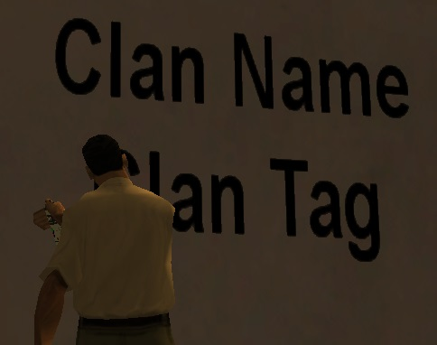

# Clans

<figure markdown="span">
    { width=400" }
</figure>

B-Zone servers host a considerable number of players, which is why they group together and form teams of friends. Why not be even closer to each other? You have an ingenious system at your disposal to create your own group under a name and tag chosen by you, the clan. In the clan, there are a multitude of activities and most importantly, anyone can have their own clan. Follow the details below and you will learn more.

!!! note "Note"
    Learn how you can buy gold by following the steps on [this page](buy-gold.md).

!!! warning "Warning"
    The gold prices presented on this page are standard. It is possible that in-game products may be cheaper if you make the purchase during a discount period.

## Benefit Period

Currently, the servers have 4 clan packages with different prices and slots:

- Small clan with 15 slots (30 days) - 2000 Gold
- Medium clan with 25 slots (30 days) - 3000 Gold
- Big clan with 50 slots (30 days) - 4000 Gold
- Mega clan with 75 slots (30 days) - 5500 Gold

Upon purchasing such a package, you will be kicked by the server for synchronization to take place.

## Benefits

- A clan represents an open place where you can socialize and make new friends.
- The clan is somewhat similar to a faction, thus helping with better server integration and understanding.
- After creating the clan in-game, you have the right to request a special section on the forum, thus becoming more known.
- There is a quite attractive system that has territories for clans as stakes, thus wars between clans appear.
- Clans that meet certain conditions can win a certain amount of gold.
- The clan owner can distribute to their members a certain amount of gold won within the clan.
- The clan owner can rename rank names at any time.

## Characteristics

- After the clan benefit period expires, the owner has 30 days to renew the clan.
- If 30 days of inactivity are reached (without renewal), the clan is automatically disbanded in-game, and the clan's forum section is moved from official clans to unofficial clans.
- The owner can disband the clan at any time or transfer it to another player.

## How to Buy?

In just a few simple steps, you will get your own clan:

1. Access the community shop using the **/shop** command.
2. Select one of the following items from the displayed list:
    - **Small clan(30 Days) - 2000 Gold**
    - **Medium clan(30 Days) - 3000 Gold**
    - **Big clan(30 Days) - 4000 Gold**
    - **Mega clan(30 Days) - 5500 Gold**
3. The server will display some information about what you need to do to get the clan.
4. After reading the information, press the **Order** button.
5. Upon pressing the **Order** button, there are two purchase possibilities:
    - If you don't have a clan at that moment, the server will ask you to enter the clan name, followed by the clan tag without entering the two brackets ([TAG]).
        - As soon as you have entered all the necessary information, the server will ask you to re-log.
        - After re-logging, your clan will be active and you can use it.
    - If you already own a clan, the server will offer you information about renewing it. If the selected package contains the same number of slots as the current clan, then the clan's activity period will be increased by 30 days. If the selected package contains a different number of slots, then the clan will expire after 30 days from renewal and the number of slots will be increased or decreased accordingly.
6. After creating a clan, you are requested to contact one of the forum administrators to create your special section within the official clans.
