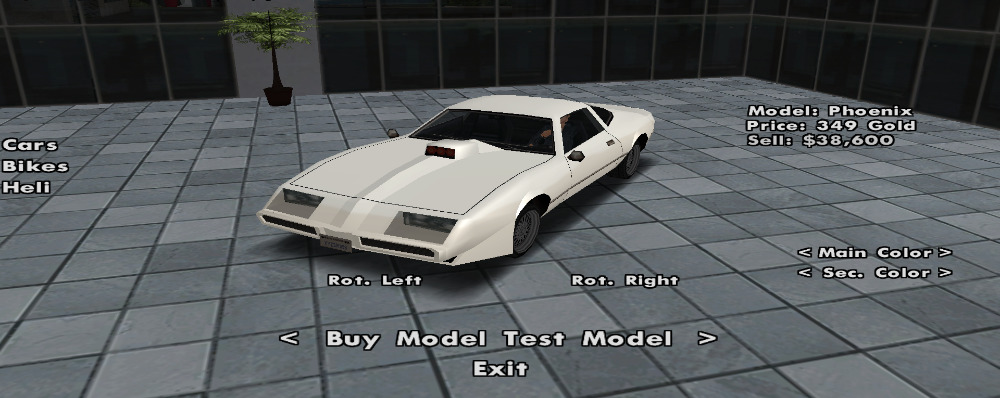

# Vehicule Gold

<figure markdown="span">
    { width=500" }
    <figcaption>Interfata Dealership-ului premium</figcaption>
</figure>

- Mai jos veti gasi o lista a tuturor vehiculelor serverului B-Zone RPG ce pot fi achizitionate din DealerShip folosind [Gold](buy-gold.md).
- Vehiculele cumparate cu Gold de la DealerShip nu pot fi vandute altor jucator, ci doar returnate DealerShip-ului.
- Contravaloarea returnarii vehiculelor cumparate cu Gold se afla notata pentru fiecare vehicul, in lista de mai jos si reprezinta 40% din valoarea acestora.
- Nu aveti nevoie de cont premium daca optati pentru a cumpara un astfel de vehicul, ci doar pentru vehiculele premium.
- Afla cum poti sa cumperi Gold, urmand pasii de pe pagina [Buy Gold](buy-gold.md).

## Masini Gold

Pentru lista completa a vehiculelor Gold disponibile in DealerShip, inclusiv preturile si specificatiile tehnice ale acestora, va rugam sa verificati in joc folosind comanda **/buyvehicle** sau vizitati DealerShip-ul premium.

### Exemple de vehicule disponibile:

- **Buffalo** - 2.149 Gold
- **Premier** - 299 Gold
- **Sabre** - 1.699 Gold
- **Comet** - 1.949 Gold
- **Sandking** - 1.599 Gold
- **Super GT** - 1.899 Gold
- **Feltzer** - 999 Gold
- **Jester** - 1.799 Gold
- **Sultan** - 2.199 Gold
- **Elegy** - 2.099 Gold
- **Cheetah** - 2.299 Gold
- **Bullet** - 2.849 Gold
- **Infernus** - 2.999 Gold
- **Turismo** - 2.499 Gold
- **Banshee** - 2.599 Gold
- **Monster Truck** - 3.799 Gold
- **Hotring** - 3.799 Gold

## Biciclete/Motociclete Gold

- **Freeway** - 649 Gold
- **FCR-900** - 899 Gold
- **NRG-500** - 1.899 Gold

## Elicoptere Gold

- **Sparrow** - 2.399 Gold
- **Maverick** - 4.999 Gold

## Legenda

- **Pret Dealership (Gold)** - pretul bunului cumparat cu Gold in DealerShip-ul de pe shop.
- **Dealership Gold refund** - Suma de bani pe care o primesti in cazul in care iti vinzi masina DealerShip-ului (/v -> vehicul -> vinde).
- **Viteza maxima** - Viteza maxima pe care vehiculul o poate atinge.
- **Provenit din** - Nume de masini reale asociate prin asemamete cu cele din San Andreas.
- **Numar de locuri** - Numarul maxim de jucatori ce pot intra in acelasi timp in vehicul (cu tot cu sofer).
- **Pret in Gold** - Reprezinta cantitatea de Gold necesara achizitionarii vehiculului.
- **Tunabil** - In cazul in care vehiculul este tunabil, este afisat numele tuning-ului de care apartine, iar in caz contrar este afisat mesajul "Nu este tunabil".
