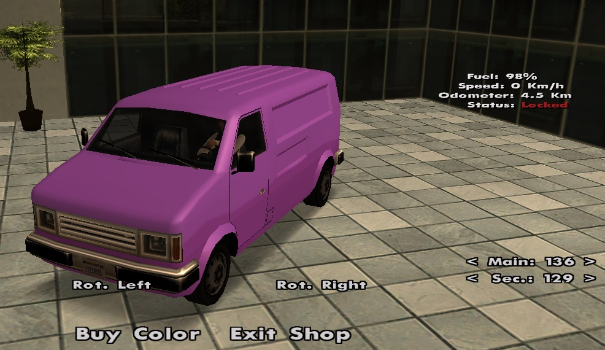

# Hidden Color

<figure markdown="span">
    { width=400" }
</figure>

Daca doresti un vehicul stralucitor cu o culoare aparte, speciala, deosebita fata de a tuturor celorlalti, atunci trebuie sa-ti cumperi un set de culori ascunse (hidden) pentru vehiculul tau.

!!! note "Nota"
    Afla cum poti sa cumperi gold urmand pasii din [aceasta pagina](buy-gold.md).

!!! warning "Atentie"
    Preturile in gold prezentate in aceasta pagina sunt cele standard. Este posibil ca in joc produsele sa fie mai ieftine daca faceti achizitionarea intr-o perioada de reduceri.

## Pret si durata

- Pretul unui set de doua culori (primara si secundara) costa 600 de gold (vezi /shop).
- Odata achizitionate cele doua culori, vor ramane utilizabile pentru vehiculul tau pentru totdeauna, insa daca doriti sa vindeti vehiculul altui jucator, setul de culori va disparea.

## Cum cumperi?

In doar cativa pasi simplii, vehiculul tau poate sa dispuna de un astfel de set de culori:

1. Accesati magazinul comunitatii folosind comanda **/shop**.
2. Selectati din lista afisata urmatorul item: **Hidden color - 600 Gold**.
3. Serverul va va afisa cateva informatii despre ce trebuie sa faceti pentru a intra in posesia setului de culori.
4. Dupa citirea informatiilor, apasati butonul **Order**.
5. Daca aveti un checkpoint rosu activ pe harta, serverul va abandona comanda voastra, voi fiind nevoiti sa folositi comanda **/cancel checkpoint** pentru a-l anula. Odata anulat checkpointul, urmati pasii de la inceput.
6. Serverul va va fixa un checkpoint rosu pe harta, acolo trebuie sa ajungeti cu vehiculul caruia doriti sa-i instalati setul de culori.
7. In cazul in care v-ati anulat checkpointul rosu oferit de butonul **Order**, nu va faceti griji. Tastati comanda /hiddencolor si checkpointul va aparea din nou.
8. Pentru a intra in meniul de selectare a setului de culori ascunse (hidden), trebuie sa tastati comanda **/hiddencolor** aflandu-va langa bizul CarColor.
9. Dupa terminarea selectarii celor doua culori ascunse, apasati butonul **Buy Color**.
10. **Felicitari!** Aveti un vehicul mai frumos.

## Tutorial
<iframe width="560" height="315" src="https://www.youtube.com/embed/d6trHsbrhig" frameborder="0" allowfullscreen></iframe>
