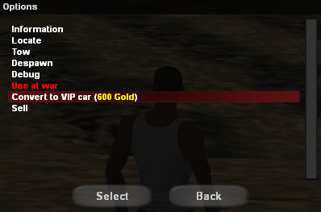
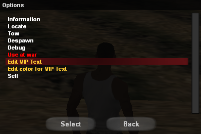

# VIP Car

<figure markdown="span">
    { width=400" }
    <figcaption>Convert to VIP vehicle</figcaption>
</figure>

<figure markdown="span">
    { width=400" }
    <figcaption>Vehicle Menu</figcaption>
</figure>

<figure markdown="span">
    { width=400" }
    <figcaption>VIP vehicle edit menu</figcaption>
</figure>

Players can customize their vehicles as they wish. If you want a unique vehicle with a personalized text, then you have the possibility to convert your normal car into a VIP car.

!!! note "Note"
    Learn how you can buy gold by following the steps on [this page](buy-gold.md).

!!! warning "Warning"
    The gold prices presented on this page are standard. It is possible that in-game products may be cheaper if you make the purchase during a discount period.

## Price and Duration

- The price of converting a normal vehicle into a VIP vehicle costs 600 Gold (see /shop).
- Once the vehicle is converted, it will remain VIP until it is sold to another player or to the dealership. Upon sale, the VIP status is lost and it becomes a normal vehicle again.

## Conversion

- Vehicle conversion is done from the vehicle menu (/v) by selecting the desired vehicle, then the Convert to VIP car option.
- There is a limited number of vehicles that can be converted: **Sultan, Cheetah, Turismo, Banshee, Bullet, Infernus, Hotring, Hotring A, Hotring B, Monster, Monster A, Monster B, Maverick, Packer, Stuntplane, Sparrow, Shamal, Dune, Flatbed, Raindance, Bus/Coach, Roadtrain, Leviathan, DFT-30 and Tractor**.
- VIP vehicles will appear in the vehicle menu with VIP status.
- The text position on VIP vehicles is dynamic, the text can be placed anywhere the owner wants near the vehicle.
- The system will allow you to modify the text and its color as many times as you want.

!!! danger "Note"
    Using vulgar or offensive text will be sanctioned by admins.

## How to Buy?

In just a few simple steps, your vehicle can become VIP:

1. Access the vehicle menu using the **/v** command.
2. Select a vehicle from the list that can be converted, then click on: **Convert to VIP car (600 Gold)**.
3. The server will display some information about VIP vehicles, namely that this status is lost when selling the vehicle.
4. After reading the information, press the **Yes** button.
5. **Congratulations!** You now have your first VIP vehicle.
6. You can further modify the text itself and its color from the /v menu, selecting the VIP vehicle.
